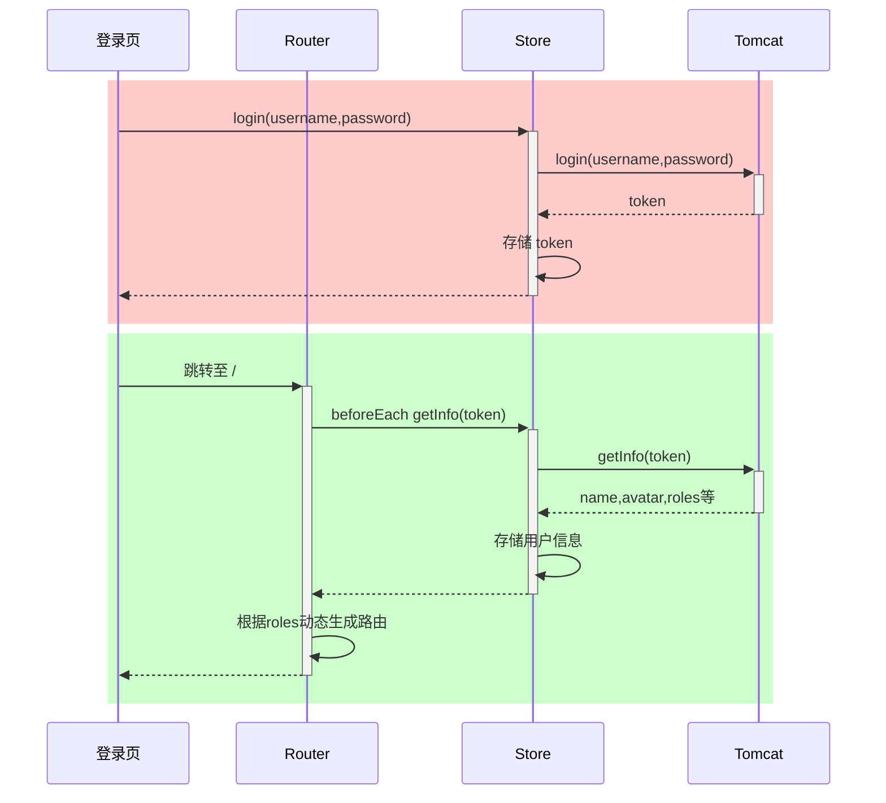
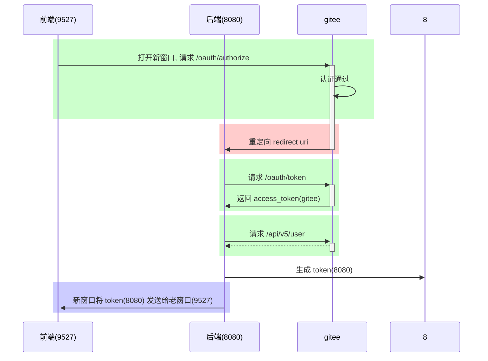

# Vue 基础

## 环境准备

### 安装脚手架

```sh
npm install -g @vue/cli
```

> -g 参数表示全局安装，这样在任意目录都可以使用 vue 脚本创建项目

### 创建项目

> 在命令行中输入vue ui

```sh
vue ui
```

> 使用图形向导来创建 vue 项目，输入项目名。选择手动配置，项目添加 vue router 和 vuex
>
> 选择版本，创建项目


> 手动选中目录，进行项目安装
>


> 除默认外，选择router和vuex


### 安装 vue开发者工具插件

> devtools 插件网址：https://devtools.vuejs.org/guide/installation.html
>

## 运行项目

进入项目目录，执行

```sh
npm run serve
```


### 修改端口

> 前端服务器默认占用了 8080 端口，需要修改一下
>

> 文档地址：[DevServer | webpack](https://webpack.js.org/configuration/dev-server/#devserverport)
>

> 打开 vite.config.js 添加
>

```js
const { defineConfig } = require('@vue/cli-service')
module.exports = defineConfig({
  
  // ...
    
  devServer: {
    port: 7070
  }
})
```

重启服务器，即可发现端口号已经被修改


### 添加代理

> 为了避免前后端服务器联调时， fetch、xhr 请求产生跨域问题，需要配置代理，打开 vite.config.js 添加
>

```js
const { defineConfig } = require('@vue/cli-service')
module.exports = defineConfig({
    
  // ...
    
  devServer: {
    port: 7070,
    proxy: {
      '/api': { // 只要以api开头的逻辑，都将是可以跨域的
        target: ':8080',
        changeOrigin: true
      }
    }
  }
    
})
```

此时后端项目已经启动，访问测试：:7071/api/students


### 项目结构

```
PS D:\2022.js\代码\第3章\client> tree src
D:\2022.JS\代码\第3章\CLIENT\SRC
├─assets
├─components
├─router
├─store
└─views
```

> * assets - 静态资源
> * components - 可重用组件
> * router - 路由
> * store - 数据共享
> * views - 视图组件

以后还会添加

> * api - 跟后台交互，发送 fetch、xhr 请求，接收响应
> * plugins - 插件


# Vue 基本语法

## 组成三部分

> Vue 的组件文件以 .vue 结尾，每个组件由三部分组成
>

```vue
<template></template>

<script></script>

<style></style>
```

> * template 模板部分，由它生成 html 代码
> * script 代码部分，控制模板的数据来源和行为
> * style 样式部分，一般不咋关心

## 入口组件

先删除原有代码，来个 Hello, World 例子

```vue
<template>
  <h1>{{msg}}</h1>
</template>

<script>
export default {
  data() {
    return {
      msg: "Hello, Vue!"
    }
  }
}
</script>
```

> * export default 导出组件对象，供 main.js 导入使用
> * 这个对象有一个 data 方法，返回一个**对象**，给 template 提供数据
> * `{{}}` 在 Vue 里称之为插值表达式，用来**绑定** data 方法返回的**对象**属性，**绑定**的含义是数据发生变化时，页面显示会同步变化

```vue
<template>
  <div id="app">
    <h1>{{msg}}</h1>
  </div>
</template>

<script>
const options = {
  data() {
    return {
      msg: '123'
    }
  }
}
// 也可以先定义函数，再进行导出
export default options
</script>
```

## 文本插值

```vue
<template>
    <div>
        <h1>{{ name }}</h1>
        <h1>{{ age > 60 ? '老年' : '青年' }}</h1>
    </div>
</template>
<script>
const options = {
    data: function () {
        return { name: '张三', age: 70 };
    }
};
export default options;
</script>
```

```js
data() {
  return {
    name: '张三',
    age: 70
  }
}
```

> * `{{}}` 里只能绑定一个属性，绑定多个属性需要用多个 `{{}}` 分别绑定
> * template 内只能有一个根元素
> * 插值内可以进行简单的表达式计算


## 属性绑定

> 简写方式：可以省略 v-bind 只保留冒号
>

```vue
<template>
    <div>
        <div><input type="text" v-bind:value="name"></div>
        <div><input type="date" v-bind:value="birthday"></div>
        <div><input type="text" :value="age"></div>
    </div>
</template>
<script>
const options = {
    data: function () {
        return { name: '王五', birthday: '1995-05-01', age: 20 };
    }
};
export default options;
</script>
```


## 事件绑定

> * 简写方式：可以把 v-on: 替换为 @
> * 在 methods 方法中的 this 代表的是 data 函数返回的数据对象

```vue
<!-- 事件绑定 -->
<template>
    <div>
        <div><input type="button" value="点我执行m1" v-on:click="m1"></div>
        <div><input type="button" value="点我执行m2" @click="m2"></div>
        <div>{{count}}</div>
    </div>
</template>
<script>
const options = {
    data: function () {
        return { count: 0 };
    },
    methods: {
        m1() {
            this.count ++;
            console.log("m1")
        },
        m2() {
            this.count --;
            console.log("m2")
        }
    }
};
export default options;
</script>
```

## 双向绑定

用 v-model 实现双向绑定，即 

> * javascript 数据可以同步到表单标签
> * 反过来用户在表单标签输入的新值也会同步到 javascript 这边
>
> * **双向绑定只适用于表单这种带【输入】功能的标签，其它标签的数据绑定，单向就足够了**
> * **复选框这种标签，双向绑定的 javascript 数据类型一般用数组**

```vue
<template>
    <div>
        <div>
            <label for="">请输入姓名</label>
            <input type="text" v-model="name">
        </div>
        <div>
            <label for="">请输入年龄</label>
            <input type="text" v-model="age">
        </div>
        <div>
            <label for="">请选择性别</label>
            男 <input type="radio" value="男" v-model="sex">
            女 <input type="radio" value="女" v-model="sex">
        </div>
        <div>
            <label for="">请选择爱好</label>
            游泳 <input type="checkbox" value="游泳" v-model="fav">
            打球 <input type="checkbox" value="打球" v-model="fav">
            健身 <input type="checkbox" value="健身" v-model="fav">
        </div>
    </div>
</template>
<script>
const options = {
    data: function () {
        return { name: '', age: null, sex:'男' , fav:['打球']};
    },
    methods: {
    }
};
export default options;
</script>
```


## 计算属性

> 普通方法调用必须加 ()，没有缓存功能
>
> 计算属性使用时就把它当属性来用，不加 ()，有缓存功能：
>
> **一次计算后，会将结果缓存，下次再计算时，只要数据没有变化，不会重新计算，直接返回缓存结果**

```vue
<!-- 计算属性 -->
<template>
    <div>
        <h2>{{fullName}}</h2>
        <h2>{{fullName}}</h2>
        <h2>{{fullName}}</h2>
    </div>
</template>
<script>
const options = {
    data: function () {
        return { firstName: '三', lastName: '张' };
    },
    /* methods: {
        fullName() {
            console.log('进入了 fullName')
            return this.lastName + this.firstName;
        }
    },*/
    computed: {
        fullName() {
            console.log('进入了 fullName')
            return this.lastName + this.firstName;
        }
    }
};
export default options;
```


## 条件渲染⭐

> 这边可以在学完axios再来

### 后端代码

```sql
create database if not exists server;
use server;
drop table if exists student;
create table student (
    id int primary key auto_increment,
    name varchar(32) not null,
    sex char(1),
    age tinyint
);
insert into student(name,sex,age) values
('宋远桥', '男', 40),
('俞莲舟', '男', 38),
('俞岱岩', '男', 32),
('张松溪', '男', 27),
('张翠山', '男', 24),
('殷梨亭', '男', 19),
('莫声谷', '男', 17);
```

```xml
<dependencies>
    <dependency>
        <groupId>org.springframework.boot</groupId>
        <artifactId>spring-boot-starter-web</artifactId>
    </dependency>

    <dependency>
        <groupId>org.mybatis.spring.boot</groupId>
        <artifactId>mybatis-spring-boot-starter</artifactId>
        <version>2.2.2</version>
    </dependency>

    <dependency>
        <groupId>mysql</groupId>
        <artifactId>mysql-connector-java</artifactId>
    </dependency>

    <dependency>
        <groupId>org.projectlombok</groupId>
        <artifactId>lombok</artifactId>
    </dependency>
</dependencies>
```

```properties
spring.datasource.url=jdbc:mysql://localhost:3306/server
spring.datasource.username=root
spring.datasource.password=123456
spring.sql.init.mode=always
spring.sql.init.encoding=UTF-8
```

```java
@Data
public class Student {
    private int id;
    private String name;
    private String sex;
    private int age;
}
```

```java
@RestController
public class StudentController {

    @Resource
    private StudentService studentService;

    @GetMapping("/api/students")
    public R all() {
        return R.ok(studentService.findAll());
    }
}
```

```java
@Service
public class StudentService {
    
    @Autowired
    private StudentMapper studentMapper;

    public List<Student> findAll() {
        return studentMapper.findAll();
    }
}
```

```java
@Mapper
public interface StudentMapper {

    @Select("select * from student")
    List<Student> findAll();
}
```

### 前端代码

```vue
<template>
    <div>
        <input type="button" value="获取远程数据" @click="sendReq()">
        <div class="title">学生列表</div>
        <div class="thead">
            <div class="row bold">
                <div class="col">编号</div>
                <div class="col">姓名</div>
                <div class="col">性别</div>
                <div class="col">年龄</div>
            </div>
        </div>
        <div class="tbody"> <!-- 条件渲染，数组没数据就提示暂无学生数据 -->
            <div class="row" v-if="students.length > 0">
                <!-- for...of 用来遍历数组 -->
                <div class="row" v-for="s of students" :key="s.id">
                    <div class="col">{{s.id}}</div>
                    <div class="col">{{s.name}}</div>
                    <div class="col">{{s.sex}}</div>
                    <div class="col">{{s.age}}</div>
                </div>
            </div>
            <div class="row" v-else>暂无学生数据</div>
        </div>
    </div>
</template>
<script>
import axios from '../util/myaxios'
const options = {
    data: function() {
        return {
            students: []
        };
    },
    methods : {
        async sendReq() {
            const resp = await axios.get("/api/students");
            console.log(resp.data.data)
            this.students = resp.data.data;
        }
    }
};
export default options;
</script>
<style scoped>
    div {
        font-family: 华文行楷;
        font-size: 20px;
    }

    .title {
        margin-bottom: 10px;
        font-size: 30px;
        color: #333;
        text-align: center;
    }

    .row {
        background-color: #fff;
        display: flex;
        justify-content: center;
    }

    .col {
        border: 1px solid #f0f0f0;
        width: 15%;
        height: 35px;
        text-align: center;
        line-height: 35px;
    }

    .bold .col {
        background-color: #f1f1f1;
    }
</style>
```


## 列表渲染

> * v-if 和 v-for 不能用于同一个标签
> * v-for 需要配合特殊的标签属性 key 一起使用，并且 key 属性要绑定到一个能起到唯一标识作用的数据上，本例绑定到了学生编号上
> * options 的 mounted 属性对应一个函数，此函数会在组件挂载后（准备就绪）被调用，可以在它内部发起请求，去获取学生数据

```vue
<template>
    <div>
        <!-- <input type="button" value="获取远程数据" @click="sendReq()"> -->
        <div class="title">学生列表</div>
        <div class="thead">
            <div class="row bold">
                <div class="col">编号</div>
                <div class="col">姓名</div>
                <div class="col">性别</div>
                <div class="col">年龄</div>
            </div>
        </div>
        <div class="tbody"> <!-- v-if和v-for不能在同一个div中 -->
            <div v-if="students.length > 0"> <!-- 列表渲染，这里用of和in都行 -->
                <div class="row" v-for="s of students" :key="s.id">
                    <div class="col">{{s.id}}</div>
                    <div class="col">{{s.name}}</div>
                    <div class="col">{{s.sex}}</div>
                    <div class="col">{{s.age}}</div>
                </div>
            </div>
            <div class="row" v-else>暂无学生数据</div>
        </div>
    </div>
</template>
<script>
import axios from '../util/myaxios'
const options = {
    mounted: function(){
        this.sendReq()
    },
    data: function() {
        return {
            students: []
        };
    },
    methods : {
        async sendReq() {
            const resp = await axios.get("/api/students");
            console.log(resp.data.data)
            this.students = resp.data.data;
        }
    }
};
export default options;
</script>
<style scoped>
    div {
        font-family: 华文行楷;
        font-size: 20px;
    }

    .title {
        margin-bottom: 10px;
        font-size: 30px;
        color: #333;
        text-align: center;
    }

    .row {
        background-color: #fff;
        display: flex;
        justify-content: center;
    }

    .col {
        border: 1px solid #f0f0f0;
        width: 15%;
        height: 35px;
        text-align: center;
        line-height: 35px;
    }

    .bold .col {
        background-color: #f1f1f1;
    }
</style>
```


## 重用组件

> 定义按钮组件，其他组件可以修改该组件的大小

### MyButton.vue

```vue
<template> <!-- 通过props接收参数，来进行选择样式 -->
    <div class="button" :class="[type,size]">
        a<slot></slot>b
    </div>
</template>
<script>
const options = {
    props: ["type", "size"]
};
export default options;
</script>
```


> 样式，写在该页面中就行，不用另写
>

```css
<style scoped>
.button {
    display: inline-block;
    text-align: center;
    border-radius: 30px;
    margin: 5px;
    font: bold 12px/25px Arial, sans-serif;
    padding: 0 2px;
    text-shadow: 1px 1px 1px rgba(255, 255, 255, .22);
    box-shadow: 1px 1px 1px rgba(0, 0, 0, .29), inset 1px 1px 1px rgba(255, 255, 255, .44);
    transition: all 0.15s ease;
}

.button:hover {
    box-shadow: 1px 1px 1px rgba(0, 0, 0, .29), inset 1px 1px 2px rgba(0, 0, 0, .5);
}

.button:active {
    box-shadow: inset 1px 1px 2px rgba(0, 0, 0, .8);
}

.primary {
    background-color: #1d6ef9;
    color: #b5e3f1;
}

.danger {
    background-color: rgb(196, 50, 50);
    color: white;
}

.success {
    background-color: #a5cd4e;
    ;
    color: #3e5706;
}

.small {
    width: 40px;
    height: 20px;
    font-size: 10px;
    line-height: 20px;
}

.middle {
    width: 50px;
    height: 25px;
    font-size: 14px;
    line-height: 25px;
}

.large {
    width: 60px;
    height: 30px;
    font-size: 18px;
    line-height: 30px;
}
</style>
```

### App.vue

使用组件

```vue
<template>
    <div>
        <h1>父组件</h1>
        <my-button type="primary" size="small">1</my-button>
        <my-button type="danger" size="middle">2</my-button>
        <my-button type="success" size="large">3</my-button>
    </div>
</template>
<script>
import MyButton from '../components/MyButton.vue'
const options = {
    components: {
        MyButton
    }
};
export default options;
</script>
```


# 网络请求

> axios 它的底层是用了 XMLHttpRequest（xhr）方式发送请求和接收响应，xhr 相对于之前讲过的 fetch api 来说，功能更强大，但由于是比较老的 api，不支持 Promise，axios 对 xhr 进行了封装，使之支持 Promise，并提供了对请求、响应的统一拦截功能
>

## 安装和导入

```cmd
npm install axios -S
```

```js
import axios from 'axios'
```

> axios 默认导出一个对象，这里的 import 导入的就是它默认导出的对象
>

## 基本方法

| 请求                               | 备注   |
| ---------------------------------- | ------ |
| axios.get(url[, config])           | :star: |
| axios.delete(url[, config])        |        |
| axios.head(url[, config])          |        |
| axios.options(url[, config])       |        |
| axios.post(url[, data[, config]])  | :star: |
| axios.put(url[, data[, config]])   |        |
| axios.patch(url[, data[, config]]) |        |

> * config - 选项对象、例如查询参数、请求头...
> * data - 请求体数据、最常见的是 json 格式数据
> * get、head 请求无法携带请求体，这应当是浏览器的限制所致（xhr、fetch api 均有限制）
> * options、delete 请求可以通过 config 中的 data 携带请求体

## 初体验

### 后端配置

```java
@Data
@AllArgsConstructor
@NoArgsConstructor
public class Student {
    private int id;
    private String name;
    private String sex;
    private int age;
}
```

```java
@GetMapping("/api/students")
public List<Student> list() {
    // 模拟从数据库中查到得数据
    List<Student> students = new ArrayList<>();
    students.add(new Student(1,"ren","男",12));
    students.add(new Student(2,"wang","男",22));
    return students;
}                                                                                             
```

访问测试：:8080/api/list


> 后端跨域配置

```java
@Configuration
public class CorsConfig implements WebMvcConfigurer {
    
    @Override
    public void addCorsMappings(CorsRegistry registry) {
        registry.addMapping("/**")
                .allowedOrigins("*") // 支持方法
                .allowedMethods("GET", "HEAD", "POST", "PUT", "DELETE", "OPTIONS") 
                .allowCredentials(false) // 是否发送 Cookie
                .maxAge(3600)
                .allowedHeaders("*");
    }
}
```

### 前端配置

#### vite.config.js

```js
const { defineConfig } = require('@vue/cli-service')
module.exports = defineConfig({
  transpileDependencies: true,
  devServer: {
    port: 7070,
    proxy: {
      '/api': {
        target: ':8080', // api接口的请求跳转到8080
        changeOrigin: true
      }
    }
  }
})
```

#### Example6View.vue

```vue
<template>
    <div>
        <input type="button" value="获取远程数据" @click="sendReq()">
    </div>
</template>
```

```js
import axios from 'axios'

methods: {
  async sendReq() { 
    // 直接获取后端数据，因为前面配置了代理，所以这里不配axios.defaultURL也行
    // 只要是以api开头的请求，都会指向8080
    const resp = await axios.get('/api/students');
    console.log(resp)
  }
}
```


## 常见请求

### GET 请求

#### 简单请求

```java
@GetMapping("/api/a1")
public String a1() {
    return "get request";
}
```

```js
methods: {
  async sendReq() {
    // 直接获取后端数据
    const resp = await axios.get('/api/a1');
    console.log(resp)
  },
}
```

#### 带参请求

```java
@GetMapping("/api/a41")
public String a41(String name, Integer age) {
    System.out.println("name: " + name + " age:" + age);
    return "post request";
}
```

```js
async sendReq() {
    const resp = await axios.get('/api/a41', {
        params: {
            name:'&&&&',
            age: 20
        }
    });
},
```

### POST 请求

#### 简单请求

```java
@PostMapping("/api/a2")
public String a2() {
    return "post request";
}
```

```js
async sendReq() {
    // 1. 演示 get, post
    const resp = await axios.post('/api/a2');
    console.log(resp)
}
```


#### 带参请求⭐

> 后端接口

```java
@PostMapping("/api/a4")
public String a4(String name, Integer age) {
    System.out.println("name: " + name + " age:" + age);
    return "post request";
}
```

> 方式一：手动拼接路径请求

```js
async sendReq() {
    // 3. 发送请求时携带查询参数 ?name=xxx&age=xxx
    const name = encodeURIComponent('renshuo'); // 避免出现特殊字符如&字符，可以先encodeURL
    const age = 18;
    const resp = await axios.post(`/api/a4?name=${name}&age=${age}`);
    console.log(resp)
}
```

> 方式二：自动拼接路径请求：使用第三个参数+params传参

```js
async sendReq() {
    // 不想自己拼串、处理特殊字符、就用下面的办法，第二个参数是data，第三个参数是config
    // 配置params可以实现路径带参?传参
    const resp = await axios.post('/api/a4', {}, {
        params: {
            name:'&&&&',
            age: 20
        }
    });
},
```

> 方式三：URLSearchParams 数据

```js
async sendReq() {
    // 用请求体发数据，格式为 urlencoded
    const params = new URLSearchParams();
    params.append("name", "张三");
    params.append("age", 24)
    const resp = await axios.post('/api/a4', params);
    console.log(resp)
},
```


#### FormData数据

> 可以是这种对象格式数据，也可以是String name，String  age 那种格式也行

```java
record A5(String name, Integer age) {

}
```

```java
@PostMapping("/api/a5")
public String a5(A5 a5) {
    System.out.println(a5);
    return "post request";
}
```

```java
async sendReq() {
  //  用请求体发数据，格式为 multipart
  const params = new FormData();
  params.append("name", "李四");
  params.append("age", 30);
  const resp = await axios.post('/api/a5', params);
  console.log(resp)
},
```


#### JSON数据⭐

```java
record A5(String name, Integer age) {

}
```

```java
@PostMapping("/api/a5json")
public String a5json(@RequestBody A5 a5) {
    System.out.println(a5);
    return "post request";
}
```

```js
// 6. 用请求体发数据，格式为 json
const resp = await axios.post('/api/a5json', {
    name: '王五',
    age: 50
});
```

### 请求头

```java
// 获取请求头
@PostMapping("/api/a3")
public String a3(@RequestHeader("Authorization") String authorization) {
    System.out.println("authorization 头 " + authorization);
    return "post request";
}
```

```java
// 2. 发送请求头
const resp = await axios.post('/api/a3',{},{
    headers:{
        Authorization:'abc'
    }
});
console.log(resp)
```


## 默认配置

```js
const _axios = axios.create(config);
```

> * axios 对象可以直接使用，但使用的是默认的设置
> * 用 axios.create 创建的对象，可以覆盖默认设置，config 见下面说明

### 常见配置项

| 名称            | 含义                                                       |
| --------------- | ---------------------------------------------------------- |
| baseURL         | 将自动加在 url 前面                                        |
| headers         | 请求头，类型为简单对象                                     |
| params          | 跟在 URL 后的请求参数，类型为简单对象或 URLSearchParams    |
| data            | 请求体，类型有简单对象、FormData、URLSearchParams、File 等 |
| withCredentials | 跨域时是否携带 Cookie 等凭证，默认为 false                 |
| responseType    | 响应类型，默认为 json                                      |

### 实战演示

> 设置session和获取session，主要针对的是withCredentials属性

```java
@PostMapping("/api/a6set")
public String a6set(HttpSession session) {
    System.out.println("========== a6 set ==========");
    System.out.println(session.getId());
    session.setAttribute("name", "张三");
    return "post request";
}
```

```java
@PostMapping("/api/a6get")
public String a6get(HttpSession session) {
    System.out.println("========== a6 get ==========");
    System.out.println(session.getId());
    System.out.println("name: " + session.getAttribute("name"));
    return "post request";
}
```

> 前端配置

```js
async sendReq() {
    // 7. 默认配置
    const _axios = axios.create({
        baseURL: ':8080',
        withCredentials: false 
    });
    const resp = await _axios.post('/api/a6set')
    const resp1 = await _axios.post('/api/a6get')
    console.log(resp)
    console.log(resp1)
}
```

> 可以看到：两次的sessionID不同，因此不能获取name


```js
async sendReq() {
    // 7. 默认配置
    const _axios = axios.create({
        baseURL: ':8080',
        withCredentials: true
    });
    const resp = await _axios.post('/api/a6set')
    const resp1 = await _axios.post('/api/a6get')
    console.log(resp)
    console.log(resp1)
}
```

> 两次的sessionID相同，可以获取到name


> * 生产环境希望 xhr 请求不走代理，可以用 baseURL 统一修改
> * 希望跨域请求携带 cookie，需要配置 withCredentials: true，服务器也要配置 allowCredentials = true，否则浏览器获取跨域返回的 cookie 时会报错


## 响应格式

| 名称    | 含义              |
| ------- | ----------------- |
| data    | 响应体数据 :star: |
| status  | 状态码 :star:     |
| headers | 响应头            |

> * 200 表示响应成功
> * 400 请求数据不正确 age=abc
> * 401 身份验证没通过
> * 403 没有权限
> * 404 资源不存在
> * 405 不支持请求方式 post
> * 500 服务器内部错误

```js
// 错误处理
try {
    const resp = await _axios.post('/api/students');
    console.log(resp)
} catch (error) {
    console.log(error.response);
}
```


## 拦截器

### 前期准备

> utils创建request.js，写入如下代码

```js
// 引入 axios
import axios from 'axios'
// 封装 baseURL
const request = axios.create({
    baseURL:":8080"
})

// 拦截器写在此处

// 向外暴露 request
export default request;
```

> main.js中配置

```js
import request from "./utils/request.js";
//全局注册request，其他文件可通过this.request使用分装好的axios实例
Vue.prototype.$http = request
```

> 使用就是正常使用

```java
@PostMapping("/api/a5")
public String a5(A5 a5) {
    System.out.println(a5);
    return "post request";
}
```

```js
methods: {
  async sendReq() {
    //  用请求体发数据，格式为 multipart
    const params = new FormData();
    params.append("name", "李四");
    params.append("age", 30);
    const resp = await this.$http.post('/api/a5', params);
    console.log(resp)
  },
}
```


### 请求拦截器

```js
request.interceptors.request.use(
    function(config) {
      // 比如在这里添加统一的 headers
      config.headers = {
          Authorization: 'aaa.bbb.ccc' // 添加token信息
      }
      return config;
    },
    function(error) {
      return Promise.reject(error);
    }
);
```

### 响应拦截器

```js
request.interceptors.response.use(
    function (response) {
        // 2xx 范围走这里
        return response;
    },
    function (error) {
        if (error.response.status === 400) {
            console.log('请求参数不正确')
            return Promise.resolve(400)
        } else if (error.response.status === 401) {
            console.log('跳转至登录页面')
            return Promise.resolve(401)
        } else if (error.response.status === 404) {
            console.log('资源未找到')
            return Promise.resolve(404)
        }
        // 超出 2xx ，比如5xx走这里
        return Promise.reject(error)
    }
)
```


# ElementUI⭐

## 安装 & 使用

```cmd
npm install element-ui -S
```

```js
import Element from 'element-ui'
import 'element-ui/lib/theme-chalk/index.css'

Vue.use(Element)
```

> 测试，在自己的组件中使用 ElementUI 的组件
>

```vue
<div>
    <el-button>我是按钮</el-button>
    <el-button type="primary" icon="el-icon-edit" circle></el-button>
    <el-button type="success" icon="el-icon-check" circle></el-button>
</div>
```


## 表格组件


```java
@GetMapping("/api/students")
public R all() {
    return R.ok(studentService.findAll()); // 直接查询所有
}
```

```vue
<template>
    <div>
        <el-table :data="students">
            <el-table-column label="编号" prop="id"></el-table-column>
            <el-table-column label="姓名" prop="name"></el-table-column>
            <el-table-column label="性别" prop="sex"></el-table-column>
            <el-table-column label="年龄" prop="age"></el-table-column>
        </el-table>
    </div>
</template>
<script>
import axios from '../util/myaxios'
const options = {
    async mounted() {
        const resp = await axios.get('/api/students');
        this.students = resp.data.data
    },
    data() {
        return {
            students: []
        }
    }
}
export default options;
</script>
```


## 分页组件

### 触发查询条件

三种情况都应该触发查询

> * mounted 组件挂载完成后
> * 页号变化时
> * 页大小变化时

查询传参应该根据后台需求，灵活采用不同方式

> * 本例中因为是 get 请求，无法采用请求体，只能用 params 方式传参
>
> * 返回响应的格式也许会很复杂，需要掌握【根据返回的响应结构，获取数据】的能力

### 分页组件分析


```vue
<el-pagination
    @size-change="handleSizeChange"
    @current-change="handleCurrentChange"
    :current-page="currentPage4"
    :page-sizes="[100, 200, 300, 400]"
    :page-size="100"
    layout="total, sizes, prev, pager, next, jumper"
    :total="400">
</el-pagination>
```

### 完整代码实现


```vue
<!-- ElementUI 表格+分页 -->
<template>
    <div>
        <el-table v-bind:data="students" border>
            <el-table-column label="编号" prop="id"></el-table-column>
            <el-table-column label="姓名" prop="name"></el-table-column>
            <el-table-column label="性别" prop="sex"></el-table-column>
            <el-table-column label="年龄" prop="age"></el-table-column>
        </el-table>
        <!-- 属性依次是总条数，页数，当前页码，分页布局，页数选项，当前页面和页数切换事件 -->
        <el-pagination 
            :total="total"
            :page-size="queryDto.size"
            :current-page="queryDto.page"
            layout="total,prev,pager,next,sizes,jumper"
            :page-sizes="[5,10,15,20]"
            @current-change="currentChange"
            @size-change="sizeChange"
        ></el-pagination>
    </div>
</template>
<script>
import axios from '../util/myaxios'
const options = {
    mounted() {
        this.query();
    },
    methods: {
        // 当前页
        currentChange(page) { // 页面上的数据同步给JS数据
            this.queryDto.page = page;
            this.query(); // 需要再次执行获取数据方法
        },
        // 每页记录数
        sizeChange(size){ // 页面上的数据同步给JS数据
            this.queryDto.size = size;
            this.query(); // 需要再次执行获取数据方法
        },
        async query() {
            const resp = await axios.get('/api/students/q', {
                params: this.queryDto
            });
            this.students = resp.data.data.list;
            this.total = resp.data.data.total;
        }
    },
    data() {
        return {
            students: [],
            total: 0,
            queryDto: {
                page: 1,
                size: 5
            }
        }
    }
}
export default options;
</script>

<style scoped>
div {
  margin: 20px auto;
  width: 500px;
}
</style>
```


## 分页搜索


### 后端代码

```java
public record StudentQueryDto(
        String name, String sex, Integer[] age,
        int page, int size) {

    public int offset() {
        return (page - 1) * size;
    }

    public int limit() {
        return size;
    }
}
```

```java
@GetMapping("/api/students/q")
public R q(StudentQueryDto queryDto) {
    System.out.println(Arrays.toString(queryDto.age()));
    return R.ok(
            // Map.of返回的集合是不可变集合
            Map.of(
                    "list", studentService.findBy(queryDto),
                    "total", studentService.findCount(queryDto)
            )
    );
}
```

### 前端代码

```vue
<template>
    <div>
        <el-input placeholder="请输入姓名" size="mini" v-model="queryDto.name"></el-input>
        <el-select placeholder="请选择性别" size="mini" v-model="queryDto.sex" clearable>
            <el-option value="男"></el-option>
            <el-option value="女"></el-option>
        </el-select>
        
        <el-select placeholder="请选择年龄" size="mini" v-model="queryDto.age" clearable>
            <el-option value="0,20" label="0到20岁"></el-option>
            <el-option value="21,30" label="21到30岁"></el-option>
            <el-option value="31,40" label="31到40岁"></el-option>
            <el-option value="41,120" label="41到120岁"></el-option>
        </el-select>
        
        <el-button type="primary" size="mini" @click="search()">搜索</el-button>
        
        <el-divider></el-divider>
        <el-table v-bind:data="students">
            <el-table-column label="编号" prop="id"></el-table-column>
            <el-table-column label="姓名" prop="name"></el-table-column>
            <el-table-column label="性别" prop="sex"></el-table-column>
            <el-table-column label="年龄" prop="age"></el-table-column>
        </el-table>
        
        <el-pagination :total="total" :page-size="queryDto.size" 
                       :current-page="queryDto.page"
                       layout="prev,pager,next,sizes,->,total" 
                       :page-sizes="[5, 10, 15, 20]" 
                       @current-change="currentChange"
                       @size-change="sizeChange"></el-pagination>
    </div>
</template>
<script>
import axios from '../util/myaxios'
const options = {
    mounted() {
        this.query();
    },
    methods: {
        currentChange(page) {
            this.queryDto.page = page;
            this.query();
        },
        sizeChange(size) {
            this.queryDto.size = size;
            this.query();
        },
        async query() {
            const resp = await axios.get('/api/students/q', {
                params: this.queryDto
            });
            this.students = resp.data.data.list;
            this.total = resp.data.data.total;
        },
        search() {
            this.query();
        }
    },
    data() {
        return {
            students: [],
            total: 0,
            queryDto: {
                name: '',
                sex: '',
                age: '',  
                page: 1,
                size: 5
            }
        }
    }
}
export default options;
</script>
```

* sex 与  age 均用 `''` 表示用户没有选择的情况
* age 取值 `0,20` 会被 spring 转换为 `new int[]{0, 20}`
* age 取值 `''` 会被 spring 转换为 `new int[0]`


## 级联选择 & 树型菜单⭐

> 级联选择器中选项的数据结构为
>


### 测试数组

> 也就是最终返回的数据格式

```js
[
    {value:100, label:'主页',children:[
        {value:101, label:'菜单1', children:[
            {value:105, label:'子项1'},
            {value:106, label:'子项2'}
        ]},
        {value:102, label:'菜单2', children:[
            {value:107, label:'子项3'},
            {value:108, label:'子项4'},
            {value:109, label:'子项5'}
        ]},
        {value:103, label:'菜单3', children:[
            {value:110, label:'子项6'},
            {value:111, label:'子项7'}
        ]},
        {value:104, label:'菜单4'}
    ]}
]
```

### 后端代码⭐

```sql
insert into menu(id, name, icon, path, pid) values
    (100, '主页', 'el-icon-menu', '/', 0),
        (101, '菜单1', 'el-icon-menu', '/menu1', 100),
            (105, '子项1', 'el-icon-menu', '/menu1/c1', 101),
            (106, '子项2', 'el-icon-menu', '/menu1/c2', 101),
        (102, '菜单2', 'el-icon-menu', '/menu2', 100),
            (107, '子项3', 'el-icon-menu', '/menu2/c3', 102),
            (108, '子项4', 'el-icon-menu', '/menu2/c4', 102),
            (109, '子项5', 'el-icon-menu', '/menu2/c5', 102),
        (103, '菜单3', 'el-icon-menu', '/menu3', 100),
            (110, '子项6', 'el-icon-menu', '/menu3/c6', 103),
            (111, '子项7', 'el-icon-menu', '/menu3/c7', 103),
        (104, '菜单4', 'el-icon-menu', '/menu4', 100);
```

```java
@Data
public class Menu {
    private int id;
    private String name;
    private String icon;
    private String path;
    private int pid;
    private String component;
}
```

> 构建递归菜单工具类

```java
public class MenuUtils {
    // 进行递归构建树型结构
    public static List<Map<String, Object>> buildMenuHierarchy(List<Menu> menus) {
        // 第一个参数传入数据集合，第二个参数表示最终父id为0
        return buildMenuTree(menus, 0);
    }
    //这个版本使用递归来构建菜单树。buildMenuTree 方法接收菜单列表和父级菜单的ID作为参数。
    // 它遍历菜单列表，找到与给定父级ID匹配的子菜单，并递归调用自己来构建子菜单的子菜单。
    // 这样，整个菜单树就会被逐步构建起来。
    private static List<Map<String, Object>> buildMenuTree(List<Menu> menus, 
                                                           int parentId) {
        List<Map<String, Object>> result = new ArrayList<>();
        // 遍历菜单列表
        for (Menu menu : menus) {
            // 找到与给定父级ID匹配的子菜单
            if (menu.getPid() == parentId) {
                Map<String, Object> menuData = new HashMap<>();
                // 将菜单属性添加到menuData中
                menuData.put("value", menu.getId());
                menuData.put("label", menu.getName());
                // 递归构建子菜单
                List<Map<String, Object>> children = buildMenuTree(menus, menu.getId());
                // 如果子菜单不为空，则将子菜单添加到menuData中
                if (!children.isEmpty()) {
                    menuData.put("children", children);
                }
                // 将当前菜单添加到结果列表中
                result.add(menuData);
            }
        }
        return result;
    }

}
```

```java
@RestController
public class MenuController {

    @Autowired
    private MenuService menuService;

    @GetMapping("/api/menu")
    public R findAll() {
        List<Menu> menuList = menuService.findAll();
        List<Map<String, Object>> maps = MenuUtils.buildMenuHierarchy(menuList);
        return R.ok(maps);
    }
}
```


### 前端代码

> 这里是后端进行树型改造，前端直接调用即可

```js
<!-- cascader -->
<template>
    <el-cascader :options="ops"></el-cascader>
</template>
<script>
import axios from '../util/myaxios'
const options = {
    async mounted() {
        const resp = await axios.get('/api/menu')
        console.log(resp.data.data)
        this.ops = resp.data.data;
    },
    data(){
        return {
            ops: []
        }
    }
};
export default options;
</script>
<style scoped>
.el-cascader {
    margin: 10px 0 0 10px;
}
</style>
```

> 如果后端直接findAll查询所有，前端可以进行如下处理

```vue
<template>
    <el-cascader :options="ops"></el-cascader>
</template>
<script>
import axios from '../util/myaxios'
const options = {
    async mounted() {
        const resp = await axios.get('/api/menu')
        console.log(resp.data.data)
        const array = resp.data.data;
        const map = new Map(); 
        // 1. 将所有数据存入 map 集合(为了接下来查找效率)
        // 解构出id,name,pid，存入到map中，并对应改名(要符合ElementUI名称)
        for(const {id,name,pid} of array) {
            map.set(id, {value:id, label:name, pid:pid})
        }
        // 2. 建立父子关系
        // 3. 找到顶层对象
        const top = [];
        for(const obj of map.values()) {
            const parent = map.get(obj.pid); // 获取每个节点得父id
            if(parent !== undefined) {
                parent.children ??= []; // 判断children数组是否存在，不存在就创建
                parent.children.push(obj); // 将children数组给parent
            } else {
                top.push(obj) // 已经是顶层对象了，没有parent
            }
        }
        this.ops = top;
    },
    data(){
        return {
            ops: [] // 获取到得树型内容
        }
    }
};
export default options;
</script>
```

## 布局

通常主页要做布局，下面的代码是 ElementUI 提供的【上-【左-右】】布局

```vue
<template>
    <div class="container">
        <el-container>
            <el-header></el-header>
            <el-container>
                <el-aside width="200px"></el-aside>
                <el-main>
                    <router-view></router-view>
                </el-main>
            </el-container>
        </el-container>
    </div>
</template>
```

# Vue-Router

> vue 属于单页面应用，所谓的路由，就是根据浏览器路径不同，用不同的**视图组件**替换这个页面内容
>

## 基本示例

> 新建一个路由 js 文件，例如 src/router/example14.js，内容如下

> * 最重要的就是建立了【路径】与【视图组件】之间的映射关系
> * 本例中映射了 3 个路径与对应的视图组件

```js
import Vue from 'vue'
import VueRouter from 'vue-router'
// 引入页面组件
import ContainerView from '@/views/example14/ContainerView.vue'
import LoginView from '@/views/example14/LoginView.vue'
import NotFoundView from '@/views/example14/NotFoundView.vue'

Vue.use(VueRouter) 

const routes = [
  {
    path:'/',
    component: ContainerView
  },
  {
    path:'/login',
    component: LoginView
  },
  {
    path:'/404',
    component: NotFoundView
  },
  {
    path:'*',
    redirect: '/404'
  }
]

const router = new VueRouter({
  routes
})

export default router
```

> 在 main.js 中采用我们的路由 js
>

```js
import Vue from 'vue'
import e14 from './views/Example14View.vue' 
import router from './router/example14'  // 修改这里，切换使用的路由js文件
import store from './store'
import Element from 'element-ui'
import 'element-ui/lib/theme-chalk/index.css'

Vue.config.productionTip = false

Vue.use(Element)
new Vue({
  router,
  store,
  render: h => h(e14)
}).$mount('#app')
```

> 根组件是 Example14View.vue，内容为：
>

```vue
<template>
    <div class="all">
        <router-view></router-view>
    </div>
</template>
```

> 其中 `<router-view>` 起到占位作用，改变路径后，这个路径对应的视图组件就会占据 `<router-view>` 的位置，替换掉它之前的内容。其他就是普通的页面，没有什么特殊

## 动态导入

> * 静态导入是将所有组件的 js 代码打包到一起，如果组件非常多，打包后的 js 文件会很大，影响页面加载速度
> * 动态导入是将组件的 js 代码放入独立的文件，用到时才加载

```js
import Vue from 'vue'
import VueRouter from 'vue-router'

Vue.use(VueRouter)

const routes = [
  {
    path:'/',
    component: () => import('@/views/example14/ContainerView.vue')
  },
  {
    path:'/login',
    component: () => import('@/views/example14/LoginView.vue')
  },
  {
    path:'/404',
    component: () => import('@/views/example14/NotFoundView.vue')
  }
]

const router = new VueRouter({
  routes
})

export default router
```


## 嵌套路由

组件内再要切换内容，就需要用到嵌套路由（子路由），下面的例子是在【ContainerView 组件】内定义了 3 个子路由

```js
const routes = [
  {
    path:'/',
    component: () => import('@/views/example14/ContainerView.vue'),
    redirect: '/c/p1',
    children: [
      { 
        path:'c/p1',
        component: () => import('@/views/example14/container/P1View.vue')
      },
      { 
        path:'c/p2',
        component: () => import('@/views/example14/container/P2View.vue')
      },
      { 
        path:'c/p3',
        component: () => import('@/views/example14/container/P3View.vue')
      }
    ]
  },
  {
    path:'/login',
    component: () => import('@/views/example14/LoginView.vue')
  },
  {
    path:'/404',
    component: () => import('@/views/example14/NotFoundView.vue')
  },
  {
    path:'*', // 此处重点：当无法得到上面的匹配路径，其他的任意路径都会跳转到404
    redirect: '/404'
  }
]
```

子路由变化，切换的是【ContainerView 组件】中 `<router-view></router-view>` 部分的内容

```java
<template>
    <div class="container">
        <router-view></router-view>
    </div>
</template>
```

> * redirect 可以用来重定向（跳转）到一个新的地址
> * path 的取值为 * 表示匹配不到其它 path 时，就会匹配它

## 路由跳转

### 标签式

```vue
<el-aside width="200px">
    <router-link to="/c1/p1">P1</router-link>
    <router-link to="/c1/p2">P2</router-link>
    <router-link to="/c1/p3">P3</router-link>
</el-aside>
```

### 编程式

```vue
<el-header>
    <el-button type="primary" icon="el-icon-edit" 
               circle size="mini" @click="jump('/c1/p1')"></el-button>
    
    <el-button type="success" icon="el-icon-check" 
               circle size="mini" @click="jump('/c1/p2')"></el-button>
    
    <el-button type="warning" icon="el-icon-star-off" 
               circle size="mini" @click="jump('/c1/p3')"></el-button>
</el-header>
```

> jump 方法
>

```vue
<script>
const options = {
    methods : {
        jump(url) {
            this.$router.push(url);
        }
    }
}
export default options;
</script>
```

> * 其中 this.$router 是拿到路由对象
> * push 方法根据 url 进行跳转
>

## 导航菜单⭐

### 定义布局⭐

> 直接去ElementUI的Container布局容器中复制即可，App.vue


```vue
<template>
<div id="app">
  <el-container>
    <el-header>Header</el-header>
    <el-container>
      <el-aside width="200px">Aside</el-aside>
      <el-container>
        <el-main>Main</el-main>
        <el-footer>Footer</el-footer>
      </el-container>
    </el-container>
  </el-container>
</div>
</template>
```

```css
<style scoped>
.el-header, .el-footer {
  background-color: #B3C0D1;
  color: #333;
  text-align: center;
  line-height: 60px;
}

.el-aside {
  background-color: #D3DCE6;
  color: #333;
  text-align: center;
  line-height: 200px;
}

.el-main {
  background-color: #E9EEF3;
  color: #333;
  text-align: center;
  line-height: 160px;
}

body > .el-container {
  margin-bottom: 40px;
}

.el-container:nth-child(5) .el-aside,
.el-container:nth-child(6) .el-aside {
  line-height: 260px;
}

.el-container:nth-child(7) .el-aside {
  line-height: 320px;
}
</style>
```

### 修改高度为100%

> 只需要在样式中新增如下样式即可，成功实现全屏显示


```css
html,body,#app,.el-container{
  /*设置内部填充为0，几个布局元素之间没有间距*/
  padding: 0;
  /*外部间距也是如此设置*/
  margin: 0;
  /*统一设置高度为100%*/
  height: 100%;
}
```

### 设置侧边栏菜单

> 修改el-aside，将NavMenu导航菜单复制到这里即可

```vue
<el-aside width="200px">
  <el-menu
      default-active="2"
      class="el-menu-vertical-demo"
      @open="handleOpen"
      @close="handleClose"
      background-color="#545c64"
      text-color="#fff"
      active-text-color="#ffd04b">
    <el-submenu index="1">
      <template slot="title">
        <i class="el-icon-location"></i>
        <span>导航一</span>
      </template>
      <el-menu-item-group>
        <template slot="title">分组一</template>
        <el-menu-item index="1-1">选项1</el-menu-item>
        <el-menu-item index="1-2">选项2</el-menu-item>
      </el-menu-item-group>
      <el-menu-item-group title="分组2">
        <el-menu-item index="1-3">选项3</el-menu-item>
      </el-menu-item-group>
      <el-submenu index="1-4">
        <template slot="title">选项4</template>
        <el-menu-item index="1-4-1">选项1</el-menu-item>
      </el-submenu>
    </el-submenu>
    <el-menu-item index="2">
      <i class="el-icon-menu"></i>
      <span slot="title">导航二</span>
    </el-menu-item>
    <el-menu-item index="3" disabled>
      <i class="el-icon-document"></i>
      <span slot="title">导航三</span>
    </el-menu-item>
    <el-menu-item index="4">
      <i class="el-icon-setting"></i>
      <span slot="title">导航四</span>
    </el-menu-item>
  </el-menu>
</el-aside>
```

### 侧边栏右侧不平问题


```css
.el-aside {
  background-color: #D3DCE6;
  color: #333;
  /* 去掉文字水平居中，太难看 */
  text-align: left;
  line-height: 200px;
}
.el-menu {
  /* 右侧边栏不平，是因为多了个右边框 */
  border-right: none;
}
```


### 简单修改侧边栏

> 图标和菜单项文字建议用 `<span slot='title'></span>` 包裹起来`el-menu` 标签上加上 `router` 属性，表示结合导航菜单与路由对象，就可以利用菜单项的 `index` 属性来路由跳转
>

```vue
<el-aside width="200px">
   <el-menu router background-color="#545c64" text-color="#fff"
            active-text-color="#ffd04b">
   <el-submenu index="/c1">
       <span slot="title">
         <i class="el-icon-platform-eleme"></i>
          菜单1
       </span>
       <el-menu-item index="/c1/p1">
         <i class="el-icon-setting"></i>子项1</el-menu-item>
       <el-menu-item index="/c1/p2">
         <i class="el-icon-setting"></i>子项2</el-menu-item>
       <el-menu-item index="/c1/p3">
         <i class="el-icon-setting"></i>子项3</el-menu-item>
  </el-submenu>
  <el-menu-item index="/c2">
     <span slot="title">
     <i class="el-icon-phone"></i>
      菜单2
      </span>
 </el-menu-item>
 <el-menu-item index="/c3">
      <span slot="title">
     <i class="el-icon-star-on"></i>
      菜单3
      </span>
 </el-menu-item>
</el-menu>
</el-aside>
```


## 动态路由与树型菜单⭐

### 数据库表


```sql
create table user (
    id int primary key auto_increment,
    username varchar(16) not null,
    password varchar(64) not null
);

create table role (
    id int primary key auto_increment,
    name varchar(16) not null
);

create table menu (
    id int primary key auto_increment,
    name varchar(16) not null,
    icon varchar(32),
    path varchar(64),
    pid int not null,
    component varchar(64)
);

create table user_role (
    user_id int,
    role_id int,
    foreign key (user_id) references user(id),
    foreign key (role_id) references role(id)
);

create table role_menu (
    role_id int,
    menu_id int,
    foreign key (role_id) references role(id),
    foreign key (menu_id) references menu(id)
);
```

#### menu表

> 将菜单、路由信息（仅主页的）存数据库中，不同的用户查询的的菜单、路由信息是不一样的
>
> 如下字段分别是：id，菜单名，父id，组件名，图标
>
> 菜单1，2，3是使用子项进行路由跳转的，因此component为null

```sql
insert into menu(id, name, pid, path, component, icon) values
    (101, '菜单1', 0,   '/m1',    null,         'el-icon-platform-eleme'),
    (102, '菜单2', 0,   '/m2',    null,         'el-icon-delete-solid'),
    (103, '菜单3', 0,   '/m3',    null,         'el-icon-s-tools'),
    (104, '菜单4', 0,   '/m4',    'M4View.vue', 'el-icon-user-solid'),
    (105, '子项1', 101, '/m1/c1', 'C1View.vue', 'el-icon-s-goods'),
    (106, '子项2', 101, '/m1/c2', 'C2View.vue', 'el-icon-menu'),
    (107, '子项3', 102, '/m2/c3', 'C3View.vue', 'el-icon-s-marketing'),
    (108, '子项4', 102, '/m2/c4', 'C4View.vue', 'el-icon-s-platform'),
    (109, '子项5', 102, '/m2/c5', 'C5View.vue', 'el-icon-picture'),
    (110, '子项6', 103, '/m3/c6', 'C6View.vue', 'el-icon-upload'),
    (111, '子项7', 103, '/m3/c7', 'C7View.vue', 'el-icon-s-promotion');
```


#### user 表

```sql
insert into user(id,username,password) values
    (1, 'admin', '123'),
    (2, 'zhang', '123'),
    (3, 'li', '123'),
    (4, 'wang', '123'),
    (5, 'zhao', '123');
```

#### role 表

```sql
insert into role(id, name) values
    (10, '管理员'),
    (11, '运维'),
    (12, '顾客');
```

#### user_role 表

```sql
insert into user_role values
    (1,10),
    (2,11),
    (3,11),
    (4,12),
    (5,12);
```

#### role_menu 表

```sql
insert into role_menu values
    (10, 101),
    (10, 102),
    (10, 103),
    (10, 104),
    (10, 105),
    (10, 106),
    (10, 107),
    (10, 108),
    (10, 109),
    (10, 110),
    (10, 111),
    (11, 102),
    (11, 107),
    (11, 108),
    (11, 109),
    (12, 103),
    (12, 110),
    (12, 111);
```

### 递归菜单⭐

```java
public class MenuUtils1 {
    // 进行递归构建树型结构
    public static List<Menu> buildMenuHierarchy(List<Menu> menus) {
        // 第一个参数传入数据集合，第二个参数表示最终父id为0
        return buildMenuTree(menus, 0);
    }

    //这个版本使用递归来构建菜单树。buildMenuTree 方法接收菜单列表和父级菜单的ID作为参数。
    // 它遍历菜单列表，找到与给定父级ID匹配的子菜单，并递归调用自己来构建子菜单的子菜单。
    // 这样，整个菜单树就会被逐步构建起来。
    private static List<Menu> buildMenuTree(List<Menu> menus, int parentId) {
        List<Menu> result = new ArrayList<>();
        // 遍历菜单列表
        for (Menu menu : menus) {
             // 找到与给定父级ID匹配的子菜单
             if (menu.getPid() == parentId) {
                 List<Menu> children = buildMenuTree(menus, menu.getId());
                 if (!children.isEmpty()) {
                     menu.setChildren(children);
                 }
                 // 将当前菜单添加到结果列表中
                 result.add(menu);
             }
        }
        return result;
    }
}
```

### 后端实现⭐

```java
@Mapper
public interface MenuMapper {
	// 查询所有菜单
    @Select("select * from menu")
    List<Menu> findAll();
    
	// 根据用户名查询用户关联的菜单：menu、role_menu、user_role、user
    @Select("""
            select m.* from menu m
                inner join role_menu rm on m.id=rm.menu_id
                where rm.role_id in
                (select ur.role_id from user_role ur
                        inner join user u on ur.user_id=u.id
                        where u.username = #{username})
            """)
    List<Menu> findByUser(String username);
}
```

```java
@Service
public class MenuService {

    @Autowired
    private MenuMapper menuMapper;

    public List<Menu> findAll() {
        return menuMapper.findAll();
    }

    public List<Menu> findByUser(String username) {
        return menuMapper.findByUser(username);
    }

    public Object findByUserName(String username) {
        List<Menu> menuList = menuMapper.findByUser(username);
        // 构建树型结构
        List<Menu> maps = MenuUtils1.buildMenuHierarchy(menuList);
        return maps;
    }
}
```

```java
@RestController
public class MenuController {

    @Autowired
    private MenuService menuService;

    @GetMapping("/api/menu")
    public R findAll() {
        List<Menu> menuList = menuService.findAll();
        List<Map<String, Object>> maps = MenuUtils.buildMenuHierarchy(menuList);
        return R.ok(maps);
    }

    @GetMapping("/api/menu/{username}")
    public R findBy(@PathVariable String username) {
        return R.ok(menuService.findByUser(username));
    }
	// 根据姓名查询对应菜单
    @GetMapping("/api/menu1/{username}")
    public R findByUserName(@PathVariable String username) {
        return R.ok(menuService.findByUserName(username));
    }
}
```

> 访问测试

> 例如：访问 `/api/menu/admin` **返回所有的数据**了，访问 `/api/menu/wang` **返回部分数据**

> 访问：:8080/api/menu/admin


前端根据他们身份不同，动态添加路由和显示菜单

### 前端实现

> 其他没有写在的页面就是普通页面，无需管理


#### 路由和配置

> router/index.js

```js
import Vue from 'vue'
import VueRouter from 'vue-router'

Vue.use(VueRouter)

const routes = [
  {
    path: '/',
    redirect: '/login'
  },
  {
    path: '/login',
    component: () => import('@/views/example15/LoginView.vue')
  },
  {
    path: '/con',
    name: 'c', // 父路由名称为c
    component: () => import('@/views/example15/ContainerView.vue')
  },
  {
    path: '/404',
    component: () => import('@/views/example15/NotFoundView.vue')
  },
  {
    path: '*',
    redirect: '/404'
  }
]

const router = new VueRouter({
  routes
})
```

> main.js

```js
import Vue from 'vue'
import e1 from './views/Example15View.vue'
// 路由
import router from './router/example15'

import Element from 'element-ui'
import 'element-ui/lib/theme-chalk/index.css'
// 网络请求
import request from "./util/request";
// 全局注册request，其他文件可通过this.request使用分装好的axios实例
Vue.prototype.$http = request
Vue.config.productionTip = false

Vue.use(Element)
new Vue({
  router,
  store,
  render: h => h(e1)
}).$mount('#app')
```

> 路由出口

> App.vue：用于接收父路径的视图

```vue
<template>
  <div>
    <router-view/>
  </div>
</template>
```


> ContainerView.vue，接收子路由的视图

```vue
<el-main>
    <router-view></router-view>
</el-main>
```


#### 登录配置⭐

> 前端配置登录页LoginView.vue：在这里，输入admin，zhang等不同用户名，显示不同菜单


```vue
<template>
    <div class="login">
        <el-input v-model="username" placeholder="请输入用户名" size="mini"></el-input>
        <el-button type="primary" size="mini" @click="login()">登录</el-button>
    </div>
</template>
```

```js
import axios from '@/util/myaxios'
import {resetRouter, addServerRoutes} from '@/router/example15'
```

```js
const options = {
    name : 'login-view',
    data() {
        return {
            username: 'admin'
        }
    },
    methods: {
        async login() {
            resetRouter(); // 重置路由
            const resp = await axios.get(`/api/menu1/${this.username}`)
            const array = resp.data.data;
            // localStorage     即使浏览器关闭，存储的数据仍在
            // sessionStorage   以标签页为单位，关闭标签页时，数据被清除
            sessionStorage.setItem('serverRoutes', JSON.stringify(array))
            addServerRoutes(array);
            this.$router.push('/con');
        }
    }
}
export default options;
```

```css
<style scoped>
.login {
    height: 100%;
    background-color: darkseagreen;
}

.el-input--mini {
    width: 193px;
    margin: 10px 10px 0 10px;
}
</style>
```


#### 动态路由⭐

> router/index.js

```js
....
const router = new VueRouter({
  routes
})
// 在此后加

// 从 sessionStorage 中恢复路由数据
const serverRoutes = sessionStorage.getItem('serverRoutes');
if(serverRoutes) {
  const array = JSON.parse(serverRoutes);
  console.log(array)
  addServerRoutes(array)
}

// 重置路由，在用户注销时应当重置路由，上面已经写了，这里的方法外部可以直接调用
export function resetRouter() {
  router.matcher = new VueRouter({ routes }).matcher
}

// 添加服务器返回的路由信息(主要是遍历children信息，)
export function addServerRoutes(array) {
  for (const { id:pid1, children } of array) {
    if (children !== null) {
      for (const { id, pid, path, component } of children) {
        if (pid === pid1) {
          // 动态添加路由
          // 参数1：父路由名称
          // 参数2：路由信息对象
          router.addRoute('c', {
            path: path,
            name: id,
            component: () => import(`@/views/example15/container/${component}`)
          });
        }
      }
    }
  }
}

export default route
```

> * js 这边只保留几个固定路由，如主页、404 和 login
> * 以上方法执行时，将服务器返回的路由信息加入到名为 c 的父路由中去
> * 这里要注意组件路径，前面 @/views 是必须在 js 这边完成拼接的，否则 import 函数会失效

#### 路由渲染

```vue
<template>
    <div class="container">
        <el-container>
            <el-header>
            </el-header>
            <el-container>
                <el-aside width="200px">
                    <el-menu router background-color="#545c64" text-color="#fff" 
                             active-text-color="#ffd04b" :unique-opened="true">
                        <template v-for="m1 of top">
                            <el-submenu v-if="m1.children" :key="m1.id" 
                                        :index="m1.path">
                                <span slot="title">
                                    <i :class="m1.icon"></i> {{m1.name}}
                                </span>
                                <el-menu-item v-for="m2 of m1.children" :key="m2.id" 
                                              :index="m2.path">
                                    <span slot="title">
                                        <i :class="m2.icon"></i> {{m2.name}}
                                    </span>
                                </el-menu-item>
                            </el-submenu>
                            <el-menu-item v-else :key="m1.id-0" :index="m1.path">
                                <span slot="title">
                                    <i :class="m1.icon"></i> {{m1.name}}
                                </span>
                            </el-menu-item>
                        </template>
                    </el-menu>
                </el-aside>
                <el-main>
                    <router-view></router-view>
                </el-main>
            </el-container>
        </el-container>
    </div>
</template>
```

```js
<script>
const options = {
    mounted() {
        const serverRoutes = sessionStorage.getItem('serverRoutes');
        const array = JSON.parse(serverRoutes);
        this.top = array
    },
    data() {
        return {
            top: []
        }
    }
}
export default options;
</script>
```

```js
<style scoped>
.container {
    height: 100%;
    background-color: cornsilk;
    padding: 20px;
    box-sizing: border-box;
}

.el-container {
    height: 100%;
}

.el-header {
    background-color: aquamarine;
}

.el-aside {
    background-color: gold;
}

.el-main {
    background-color: dodgerblue;
}

a {
    text-decoration: none;
    display: block;
    margin: 10px 10px 0 10px;
    padding: 3px;
    font-size: 13px;
}

.router-link-active {
    color: #fff;
    background-color: darkslateblue;
}

.el-button {
    margin-top: 15px;
}
</style>
```

### 功能测试


# Vuex

> vuex 可以在多个组件之间共享数据，并且共享的数据是【响应式】的，即数据的变更能及时渲染到模板，与之对比 localStorage 与 sessionStorage 也能共享数据，但缺点是数据并非【响应式】。首先需要定义 state 与 mutations 他们一个用来读取共享数据，一个用来修改共享数据
>


## 简单使用


### router & main

```js
import Vue from 'vue'
import VueRouter from 'vue-router'

Vue.use(VueRouter)

const routes = [
  {
    path: '/',
    name: 'c',
    redirect: '/p2',
    component: () => import('@/views/example16/ContainerView.vue'),
    children: [
      {
        path: 'p1',
        component: () => import('@/views/example16/container/P1View.vue')
      },
      {
        path: 'p2',
        component: () => import('@/views/example16/container/P2View.vue')
      }
    ]
  }
]

const router = new VueRouter({
  routes
})

export default router
```

```js
import Vue from 'vue'
import e1 from './views/Example16View.vue'
import router from './router/example16'
import store from './store'
import Element from 'element-ui'
import 'element-ui/lib/theme-chalk/index.css'

import request from "./util/request";
//全局注册request，其他文件可通过this.request使用分装好的axios实例
Vue.prototype.$http = request
Vue.config.productionTip = false

Vue.use(Element)
new Vue({
  router,
  store,
  render: h => h(e1)
}).$mount('#app')
```

### store/index.js

> 读取数据，走 state, getters
>
> 修改数据，走 mutations, actions

```js
import Vue from 'vue'
import Vuex from 'vuex'
Vue.use(Vuex)

export default new Vuex.Store({
  state: {
    name: '', // 设置属性
    age: 18  
  },
  getters: {
  },
  mutations: { // 修改属性需要走这个方法
    updateName(state, name) { // 修改用户名
      state.name = name;
    }
  },
  actions: {
  },
  modules: {
  }
})
```

### P1View.vue 

> 修改数据

```vue
<template>
    <div class="p">
        <input placeholder="请修改用户姓名" v-model="name">
        <button  @click="updateName(name)">修改</button>
    </div>
</template>
```

```js
<script>
import { mapMutations } from 'vuex'

const options = {
    methods: {
        /* update(){
            // 修改共享数据，下面的方法简单一点
            this.$store.commit('updateName', this.name);
        } */
        ...mapMutations(['updateName'])
    },
    data () {
        return {
            name:''
        }
    }
}
export default options;
</script>
```

```css
<style scoped>
.p {
    background-color: yellowgreen;
    height: 100%;
}
.el-input--mini,
.el-select--mini {
    width: 163px;
    margin: 20px 10px 0 10px;
}
</style>
```

### Example16View

> 路由出口

```vue
<template>
    <div class="all">
        <router-view></router-view>
    </div>
</template>
<style scoped>
.all {
    height: 100%;
    background-color: darksalmon;
    padding: 20px;
    box-sizing: border-box;
}
</style>
```

### Container.vue

> 展示数据

```vue
<template>
    <div class="container">
        <el-container>
            <el-header>
                <div class="t">欢迎您：{{ name }}, {{ age }}</div>
            </el-header>
            <el-container>
                <el-aside width="200px">
                </el-aside>
                <el-main>
                    <router-view></router-view>
                </el-main>
            </el-container>
        </el-container>
    </div>
</template>
```

```js
<script>
import { mapState } from 'vuex'
const options = {
    // 最简单获取属性的方式
    computed: {
        ...mapState(['name', 'age'])
    }
}
export default options;
</script>
```

```css
<style scoped>
.t {
    margin-top: 5px;
    font-size: 14px;
}

.container {
    height: 100%;
    background-color: cornsilk;
    padding: 20px;
    box-sizing: border-box;
}

.el-container {
    height: 100%;
}

.el-header {
    background-color: gold;
    border-bottom: 1px solid black;
}

.el-aside {
    background-color: gold;
    border-right: 1px solid black;
}

.el-main {
    background-color: gold;
}

a {
    text-decoration: none;
    display: block;
    margin: 10px 10px 0 10px;
    padding: 3px;
    font-size: 13px;
}

.router-link-active {
    color: #fff;
    background-color: darkslateblue;
}

.el-button {
    margin-top: 15px;
}
</style>
```


## mapState⭐

每次去写 `$store.state.name` 这样的代码显得非常繁琐，可以用 vuex 帮我们生成计算属性

```vue
<template>
    <div class="container">
        <el-container>
            <el-header>
                <div class="t">欢迎您：{{ name }}, {{ age }}</div>
            </el-header>
            <el-container>
                <el-aside width="200px">
                </el-aside>
                <el-main>
                    <router-view></router-view>
                </el-main>
            </el-container>
        </el-container>
    </div>
</template>
<script>
import { mapState } from 'vuex'
const options = {
    computed: {
        ...mapState(['name', 'age'])
    }
}
export default options;
</script>
```

* mapState 返回的是一个对象，对象内包含了 name() 和 age() 的这两个方法作为计算属性
* 此对象配合 `...` 展开运算符，填充入 computed 即可使用


## mapMutations

* 类似的，调用 mutation 修改共享数据也可以简化
* mapMutations 返回的对象中包含的方法，就会调用 store.commit() 来执行 mutation 方法
* 注意参数传递略有不同

```vue
<template>
    <div class="p">
        <el-input placeholder="请修改用户姓名" 
            size="mini" v-model="name"></el-input>
        <el-button type="primary" size="mini" @click="updateName(name)">修改</el-button>
    </div>
</template>
<script>
import {mapMutations} from 'vuex'
const options = {
    methods: {
        ...mapMutations(['updateName'])
    },
    data () {
        return {
            name:''
        }
    }
}
export default options;
</script>
```

## actions

> mutations 方法内不能包括修改不能立刻生效的代码，否则会造成 Vuex 调试工具工作不准确，必须把这些代码写在 actions 方法中，也就是说，网络请求的数据要放在actions中
>


```js
import Vue from 'vue'
import Vuex from 'vuex'

Vue.use(Vuex)

/*
  读取数据，走 state, getters
  修改数据，走 mutations, actions
*/
import axios from '@/util/myaxios'
export default new Vuex.Store({
  state: {
    name: '',
    age: 18
  },
  getters: {
  },
  mutations: {
    updateName(state, name) {
      state.name = name;
    },
    // 错误的用法，如果在mutations方法中包含了异步操作，会造成开发工具不准确
    /* async updateServerName(state) {
      const resp = await axios.get('/api/user');
      const {name, age} = resp.data.data;
      state.name = name;
      state.age = age;
    } */
    updateServerName(state, user) {
      const { name, age } = user;
      state.name = name;
      state.age = age;
    }
  },
  // 发送axios请求
  actions: {
    async updateServerName(context) {
      const resp = await axios.get('/api/user');
      context.commit('updateServerName', resp.data.data) // 调用updateServerName方法
    }
  },
  modules: {
  }
})
```

* 首先应当调用 actions 的 updateServerName 获取数据
* 然后再由它间接调用 mutations 的 updateServerName 更新共享数据

页面使用 actions 的方法可以这么写

```vue
<template>
    <div class="p">
        <el-button type="primary" size="mini"
            @click="updateServerName()">从服务器获取数据,存入store</el-button>
    </div>
</template>
<script>
import { mapActions } from 'vuex'
const options = {
    methods: {
        ...mapActions(['updateServerName']) // 调用actions中的方法
    }
}
export default options;
</script>
```

> mapActions 会生成调用 actions 中方法的代码
>

> 调用 actions 的代码内部等价于，它返回的是 Promise 对象，可以用同步或异步方式接收结果
>

```js
this.$store.dispatch('action名称', 参数)
```

## 实战演练


### 后端代码

> 返回集合中任意一条数据

```java
List<Map<String, Object>> list = List.of(
        Map.of("name", "张三", "age", 18),
        Map.of("name", "李四", "age", 20),
        Map.of("name", "王五", "age", 22)
);
```

```java
@GetMapping("/api/user")
public R user() throws InterruptedException {
    Thread.sleep(1000);
    return R.ok(list.get(i++ % 3));
}
```

> 访问：:8080/api/user
>


### src/store/index.js

> router和main.js和上面的简单使用的相同，这里不再赘述

```js
import Vue from 'vue'
import Vuex from 'vuex'

Vue.use(Vuex)

// 读取数据，走 state, getters
// 修改数据，走 mutations, actions
import axios from '@/util/myaxios'
export default new Vuex.Store({
  state: {
    name: '', // 自定义属性
    age: 18
  },
  getters: {
  },
  mutations: {
    updateName(state, name) { // 自定义方法
      state.name = name;
    },
    // 错误的用法，如果在mutations方法中包含了异步操作，会造成开发工具不准确
    /* async updateServerName(state) {
      const resp = await axios.get('/api/user');
      const {name, age} = resp.data.data;
      state.name = name;
      state.age = age;
    } */
    updateServerName(state, user) {
      const { name, age } = user;
      state.name = name;
      state.age = age;
    }
  },
  // 但是在actions中操作可以解决这个问题
  // context是固定参数，不用管，进行值提交用的，外部需要调用这个方法，
  // 通过这个方法，调用mutations的方法
  actions: {
    async updateServerName(context) {
      const resp = await axios.get('/api/user');
      context.commit('updateServerName', resp.data.data)
    }
  },
  modules: {
  }
})
```

### P2View

```vue
<template>
    <div class="p">
        <el-button type="primary" size="mini"
            @click="updateServerName()">从服务器获取数据,存入store</el-button>
    </div>
</template>
<script>

const options = {
    methods: {
        updateServerName() {
            // 调用actions中的方法，返回 Promise
            this.$store.dispatch('updateServerName')
        }
    }
}
export default options;
</script>
<style scoped>
.p {
    background-color: yellowgreen;
    height: 100%;
}

.el-input--mini,
.el-select--mini {
    width: 163px;
    margin: 20px 10px 0 10px;
}
</style>
```

### ContainerView.vue

```vue
<template>
    <div class="container">
        <el-container>
            <el-header>
                <div class="t">欢迎您：{{ name }}, {{ age }}</div>
            </el-header>
            <el-container>
                <el-aside width="200px">
                </el-aside>
                <el-main>
                    <router-view></router-view>
                </el-main>
            </el-container>
        </el-container>
    </div>
</template>
```

```js
<script>
import { mapState } from 'vuex'

const options = {

    computed: {
        ...mapState(['name', 'age'])
    }
}
export default options;
</script>
```

```css
<style scoped>
.t {
    margin-top: 5px;
    font-size: 14px;
}

.container {
    height: 100%;
    background-color: cornsilk;
    padding: 20px;
    box-sizing: border-box;
}

.el-container {
    height: 100%;
}

.el-header {
    background-color: gold;
    border-bottom: 1px solid black;
}

.el-aside {
    background-color: gold;
    border-right: 1px solid black;
}

.el-main {
    background-color: gold;
}

a {
    text-decoration: none;
    display: block;
    margin: 10px 10px 0 10px;
    padding: 3px;
    font-size: 13px;
}

.router-link-active {
    color: #fff;
    background-color: darkslateblue;
}

.el-button {
    margin-top: 15px;
}
</style>
```


# Vue2 实战

> 课程不准备从头开发一个 Vue 项目，这里我准备采用这样的教学方法：带着大家看一个较为典型的基于 Vue 的项目实现，分析其中几个重点流程，这里选择了 vue-element-admin 这个项目骨架，它采用的技术与我们之前学过的较为契合

> * vue 2
> * element-ui 2
> * vue-router 3
> * vuex 3
> * axios

## 安装 & 配置  & 启动 

> * 需要切换分支到 i18n，否则不支持国际化（中文）功能
> * npm install 要多试几次，因为中间会连接 gitbub 下载一些依赖，网络不稳定会导致失败
> * npm run dev 运行后回自动打开浏览器，使用的端口是 9527

```cmd
# client-action 是新文件夹
git clone https://gitee.com/panjiachen/vue-element-admin.git client-action

cd client-action
# 默认master分支是英文，因此要切换成a分支为支持国际化分支，-a 列出所有分支
git branch -a 
# i18n：支持国际化分支
git checkout -b i18n remotes/origin/i18n
# 避免下载依赖出现问题，将git开题请求换成https请求
git config --global url."https://".insteadOf git://
# 依赖安装报错处理
# 1、删除package.json中的tui-editor依赖
# 2、npm install
# 3、npm install tui-editor@^1.3.3
# npm安装频频失败可以使用cnpm
cnpm install

npm run dev
```

在开发环境下，后端访问路径起始路径配置在文件 `.env.development` 中

```properties
VUE_APP_BASE_API = '/dev-api'
```

> 默认向后台的请求都发给 `:9527/dev-api` 的 mock-server 获得的都是模拟数据

> 需要跟真实后台联调时，改动以上地址为 `VUE_APP_BASE_API = ':8080/api'`

> 发送请求的 axios 工具被封装在 src/utils/request.js 中
>

```js
import axios from 'axios'
import { MessageBox, Message } from 'element-ui'
import store from '@/store'
import { getToken } from '@/utils/auth'

// create an axios instance
const service = axios.create({
  baseURL: process.env.VUE_APP_BASE_API, // url = base url + request url
  // withCredentials: true, // send cookies when cross-domain requests
  timeout: 5000 // request timeout
})

// ...
```

> 原有代码的 URI 路径都是这样的：
>

```
/vue-element-admin/user/login
/vue-element-admin/user/info
/vue-element-admin/user/logout
...
```

> 如果觉得不爽，可以来一个全局替换，在请求的url里，直接全局替换/vue-element-admin即可
>

```
/user/login
/user/info
/user/logout
...
```

> token 的请求头修改一下成Authorization和后端对应，在 src/utils/request.js 中
>

```js
...
service.interceptors.request.use(
  config => {
    // do something before request is sent

    if (store.getters.token) {
      // let each request carry token
      // ['X-Token'] is a custom headers key
      // please modify it according to the actual situation
      config.headers['Authorization'] = getToken()
    }
    return config
  },
  error => {
    // do something with request error
    console.log(error) // for debug
    return Promise.reject(error)
  }
)
...
```

## 后端接口

### Maven坐标

```xml
<dependencies>
    <dependency>
        <groupId>org.springframework.boot</groupId>
        <artifactId>spring-boot-starter-web</artifactId>
    </dependency>

    <dependency>
        <groupId>org.mybatis.spring.boot</groupId>
        <artifactId>mybatis-spring-boot-starter</artifactId>
        <version>2.2.2</version>
    </dependency>

    <dependency>
        <groupId>mysql</groupId>
        <artifactId>mysql-connector-java</artifactId>
    </dependency>

    <dependency>
        <groupId>org.springframework.boot</groupId>
        <artifactId>spring-boot-starter-test</artifactId>
        <scope>test</scope>
    </dependency>

    <dependency>
        <groupId>org.springframework.boot</groupId>
        <artifactId>spring-boot-devtools</artifactId>
        <scope>runtime</scope>
        <optional>true</optional>
    </dependency>

    <dependency>
        <groupId>io.jsonwebtoken</groupId>
        <artifactId>jjwt-api</artifactId>
        <version>0.11.5</version>
    </dependency>
    <dependency>
        <groupId>io.jsonwebtoken</groupId>
        <artifactId>jjwt-impl</artifactId>
        <version>0.11.5</version>
        <scope>runtime</scope>
    </dependency>
    <dependency>
        <groupId>io.jsonwebtoken</groupId>
        <artifactId>jjwt-jackson</artifactId> <!-- or jjwt-gson if Gson is preferred -->
        <version>0.11.5</version>
        <scope>runtime</scope>
    </dependency>
</dependencies>
```

### application.properties

```properties
spring.datasource.url=jdbc:mysql://localhost:3306/server
spring.datasource.username=root
spring.datasource.password=123456
spring.sql.init.mode=always
spring.sql.init.encoding=UTF-8
interceptor.key=abcdefghijklmnopqrstuvwxyz0123456789
interceptor.mode=JWT
interceptor.pass=/api/user/login
logging.level.com.itheima.mapper=debug
frontend.url=:9527
```

### 数据库表

```java
drop table if exists student;
create table student (
    id int primary key auto_increment,
    name varchar(32) not null,
    sex char(1),
    age tinyint
);
insert into student(name,sex,age) values
    ('宋远桥', '男', 40),
    ('俞莲舟', '男', 38),
    ('俞岱岩', '男', 32),
    ('张松溪', '男', 27),
    ('张翠山', '男', 24),
    ('殷梨亭', '男', 19),
    ('莫声谷', '男', 17);
```

### 工具类

```java
public record R(int code, Object data, String message) {
    public static R ok(Object data) {
        return new R(20000, data, null);
    }

    public static R error(int code, String message) {
        return new R(code, null, message);
    }
}
```

```java
@RestControllerAdvice
public class GlobalExceptionHandler {

    @ExceptionHandler
    public R handler401(Exception401 e) {
        return R.error(401, e.getMessage());
    }
}
```

### 实体类

```java
@Data
public class Student {
    private int id;
    private String name;
    private String sex;
    private int age;
}
```

```java
@Data
public class User {
    private String name;
    private String avatar;
    private String introduction;
    private String[] roles;
}
```

```java
public record StudentQueryDto(
        String name, String sex, Integer[] age,
        int page, int size) {

    public int offset() {
        return (page - 1) * size;
    }

    public int limit() {
        return size;
    }
}
```

```java
public record StudentUpdateDto (String name, String sex, Integer age) {

}
```

### Controller

```java
@RestController
public class LoginController {

    @Autowired
    private UserService userService;

    @PostMapping("/api/user/login")
    public R login(@RequestBody LoginRequest loginRequest) {
        String token = userService.login(loginRequest.username(), 
                                         loginRequest.password());
        return R.ok(Map.of("token", token));
    }

    record LoginRequest(String username, String password){}

    @GetMapping("/api/user/info")
    public R info(String token) {
        User user = userService.info(token);
        return R.ok(user);
    }

    @PostMapping("/api/user/logout")
    public R logout(@RequestHeader("Authorization") String token) {
        userService.logout(token);
        return R.ok("success");
    }
}
```

### 拦截器

```java
public class LoginInterceptor implements HandlerInterceptor {

    @Value("${interceptor.mode}")
    private final InterceptorMode interceptorMode = InterceptorMode.NONE;

    @Value("${interceptor.pass}")
    private String[] interceptorPass;

    @Autowired
    private UserService userService;

    @Override
    public boolean preHandle(HttpServletRequest request, 
                             HttpServletResponse response, Object handler) {
        System.out.println(request.getRequestURI() + " [" + request.getMethod() + "]");
        if ("OPTIONS".equals(request.getMethod()) ||
                Stream.of(interceptorPass).anyMatch(p -> 
                                                    p.equals(request.getRequestURI()))) {
            return true;
        }
        switch (interceptorMode) {
            case JWT -> {
                String token = request.getHeader("Authorization");
                if (token == null) {
                    token = request.getParameter("token");
                    if (token == null) {
                        throw new Exception401("未携带 token");
                    }
                }
                userService.verify(token);
            }
            case SESSION -> {
                Object user = request.getSession().getAttribute("user");
                if (user == null) {
                    throw new Exception401("校验 session 失败");
                }
            }
            case NONE -> {
            }
        }
        return true;
    }

    enum InterceptorMode {
        NONE, JWT, SESSION;
    }
}
```


## 登录流程

### 1. src/views/login/index.vue

```vue
<script>
import { validUsername } from '@/utils/validate'
import LangSelect from '@/components/LangSelect'
import SocialSign from './components/SocialSignin'

export default {
  // ...
  methods: {    
    handleLogin() {
      this.$refs.loginForm.validate(valid => {
        if (valid) {
          this.loading = true
          this.$store.dispatch('user/login', this.loginForm)
            .then(() => {
              this.$router.push({ path: this.redirect || '/', query: this.otherQuery })
              this.loading = false
            })
            .catch(() => {
              this.loading = false
            })
        } else {
          console.log('error submit!!')
          return false
        }
      })
    }
    // ...
  }
}
</script>
```

这里调用了 store 的 actions，`user/login`

* 因为是异步调用，因此只能用 actions
* 登录成功会优先跳转至 this.redirect 路径、否则跳转至 /
* / 查看 `src/router/index.js` 的路由表可知，会重定向至 /dashboard


### 2. src/store/modules/user.js

```js
import { login, logout, getInfo } from '@/api/user'
// ...
const actions = {
  // user login
  login({ commit }, userInfo) {
    const { username, password } = userInfo
    return new Promise((resolve, reject) => {
      login({ username: username.trim(), password: password }).then(response => {
        const { data } = response
        commit('SET_TOKEN', data.token)
        setToken(data.token)
        resolve()
      }).catch(error => {
        reject(error)
      })
    })
  }
  // ...
}
```

* 发请求用了 `src/api/user.js`，请求成功使用 commit 将 token 存入 mutations，同时往 cookie 存储了一份
* 这里的 response 其实是真正的 response.data，见后面的说明
  * 向 cookie 或 sessionStorage 存储 token 即可，token 无需做成响应式，不必放入 store
  * 作者使用了 Promise API，其实可以改变为 await 方式，提高可读性

### 3. src/api/user.js

```js
import request from '@/utils/request'

export function login(data) {
  return request({
    url: '/user/login',
    method: 'post',
    data
  })
}

// ...
```

* 其中 request 相当于我们之前封装的 myaxios

### 4. src/utils/request.js

```js
import axios from 'axios'
import { MessageBox, Message } from 'element-ui'
import store from '@/store'
import { getToken } from '@/utils/auth'

// create an axios instance
const service = axios.create({
  baseURL: process.env.VUE_APP_BASE_API, // url = base url + request url
  // withCredentials: true, // send cookies when cross-domain requests
  timeout: 5000 // request timeout
})

// ... 

service.interceptors.response.use(
  // ...
  response => {
    const res = response.data
    if (res.code !== 20000) {
      // ...
    } else {
      return res
    }
  },
  error => {
    // ...
  }
)

export default service
```

* 其中响应拦截器发现响应正确，返回 resp.data 这样，其它处代码解构时少了一层 data

### 5. src/permission.js

登录成功后，只是获得了 token，还未获取用户信息，获取用户信息是在路由跳转的 beforeEach 里做的



关键代码

```js
import router from './router'

// ...

router.beforeEach(async(to, from, next) => {
  // ...
  const hasToken = getToken()

  if (hasToken) {
    if (to.path === '/login') {
      // ...
    } else {
      // ...
      const { roles } = await store.dispatch('user/getInfo')
      // ...
    }
  } else {
    // ...
  }
})
```

* 登录后跳转至 / 之前进入这里的 beforeEach 方法，方法内主要做两件事
  * 一是调用 actions 方法获取用户角色，见 6
  * 二是根据用户角色，动态生成路由，见 7


### 6. src/store/modules/user.js

这里用其中 getInfo 方法获取用户信息，其中角色返回给 beforeEach 

```js
import { login, logout, getInfo } from '@/api/user'
// ...
const actions = {
  getInfo({ commit, state }) {
    return new Promise((resolve, reject) => {
      getInfo(state.token).then(response => {
        const { data } = response

        if (!data) {
          reject('Verification failed, please Login again.')
        }

        const { roles, name, avatar, introduction } = data

        if (!roles || roles.length <= 0) {
          reject('getInfo: roles must be a non-null array!')
        }

        commit('SET_ROLES', roles)
        commit('SET_NAME', name)
        commit('SET_AVATAR', avatar)
        commit('SET_INTRODUCTION', introduction)
        resolve(data)
      }).catch(error => {
        reject(error)
      })
    })
  }
}
```


### 7. src/router/index.js

路由表中路由分成两部分，静态路由与动态路由

```js
export const constantRoutes = [
  // ...
  {
    path: '/login',
    component: () => import('@/views/login/index'),
    hidden: true
  },
  {
    path: '/',
    component: Layout,
    redirect: '/dashboard',
    children: [
      {
        path: 'dashboard',
        component: () => import('@/views/dashboard/index'),
        name: 'Dashboard',
        meta: { title: 'dashboard', icon: 'dashboard', affix: true }
      }
    ]
  }
  // ...
]
```

* 其中 hidden: true 的路由只做路由跳转，不会在左侧导航菜单展示

动态路由

```js
export const asyncRoutes = [
  {
    path: '/permission',
    component: Layout,
    redirect: '/permission/page',
    alwaysShow: true, // will always show the root menu
    name: 'Permission',
    meta: {
      title: 'permission',
      icon: 'lock',
      roles: ['admin', 'editor'] // you can set roles in root nav
    },
    children: [
      {
        path: 'page',
        component: () => import('@/views/permission/page'),
        name: 'PagePermission',
        meta: {
          title: 'pagePermission',
          roles: ['admin'] // or you can only set roles in sub nav
        }
      },
      {
        path: 'directive',
        component: () => import('@/views/permission/directive'),
        name: 'DirectivePermission',
        meta: {
          title: 'directivePermission'
          // if do not set roles, means: this page does not require permission
        }
      },
      {
        path: 'role',
        component: () => import('@/views/permission/role'),
        name: 'RolePermission',
        meta: {
          title: 'rolePermission',
          roles: ['admin']
        }
      }
    ]
  },

  {
    path: '/icon',
    component: Layout,
    children: [
      {
        path: 'index',
        component: () => import('@/views/icons/index'),
        name: 'Icons',
        meta: { title: 'icons', icon: 'icon', noCache: true, roles: ['admin'] }
      }
    ]
  }
  // ...
}
```

* 动态路由中关联了角色信息，根据用户的角色决定那些路由可用，但这样做的缺点是把角色和路由绑定死了

### 8. src/layout/index.vue

它对应的是我们之前介绍的 Container.vue 完成主页布局的，路由路径是 /

其中又由多部分组成，其中固定不变的是

* 侧边栏
* 导航栏
* 标签栏
* 设置

变化的是中间的 dashboard 部分（AppMain），它由 router-view 配合子路由切换显示

* 进入 / 后，就会 redirect 重定向到 /dashboard 子路由
* 进入首页后，会有一个 `/api/transaction/list` 的后台请求报 404，作为练习，把它补充完整

## 第三方登录⭐

### 流程分析



1. 9527 打开新窗口，请求 `https://gitee.com/oauth/authorize?client_id=${client_id}&redirect_uri=${redirect_uri}&response_type=code`

2. gitee 认证通过，重定向至 8080，并携带 code

3. 8080 发送请求 `https://gitee.com/oauth/token` 携带 client_id、client_secret、code，gitee 返回 access_token 给 8080
   * 这时走的是 https 协议，并且不经过浏览器，能够保证数据传输的安全性
   
   * 重定向到 8080 时，如果被有心人拿到了 code，也没事，因为接下来会把 client_secret 发给 gitee 验证（client_secret 应当只存在 8080），只要 client_secret 不泄露，就可以保证安全
   
   * 如果改成前端拿 code 换 access_token，那就意味着 access_token 得保存在前端，所有保存在前端的都有风险
   
4. 8080 可以访问 gitee 的 api 了，拿到用户信息，存入数据库，返回 8080 的 token

5. 8080 可以通过 window.opener.postMessage 把 token 给 9527 的老窗口
   * 这里又会涉及到跨域，不过 9527 与 8080 直接存在信任关系，设置一下就好
   
6. 9527 再走之前的逻辑就可以了，在 router 的 beforeEach 方法里，用 8080 token 换用户信息

### Gitee开启权限

> 设置--------数据管理-------第三方应用


> 创建应用


> 获得的信息

```sh
应用名称：renshuoVue
Client ID：1ba97cb4978a8568f7f93a93e1ccc091dd9985d6610b3577baac6f4bb39ef153
Client Secret：b7a44f80299d577e3edd5ea43bcc2155eb282f4fd463cfdbea3a47af03437d54
应用主页：:8080
回调地址：:8080/tp/gitee_cb
```

### 前端配置-基础版⭐

#### GiteeLogin.vue

```vue
<!-- 文本插值 -->
<template>
  <div>
    <button @click="mayun()">码云</button>
  </div>

</template>

<script>
import { setToken } from '@/util/auth.js'
// 监听Gitee小窗口的token信息
window.addEventListener('message', e => {
  if (e.origin === ':8080') {
    // 保存token
    setToken(e.data)
    sessionStorage.setItem("token",e.data)
    // 跳转到根路径
    window.location.href = '/'
  }
})

const options = {
  data() {
    return {

    }
  },
  methods: {
    mayun() {
      const client_id = '1ba97cb4978a8568f7f93a93e1ccc091dd9985d6610b3577baac6f4bb39ef153'
      const redirect_uri = encodeURIComponent(':8080/tp/gitee_cb')
      const url = `https://gitee.com/oauth/authorize?client_id=${client_id}&redirect_uri=${redirect_uri}&response_type=code`
      window.open(url,540, 540)
    }
  }

};
export default options;
</script>

<style scoped>
div {
  display: flex;
  justify-content: center;
  font-family: 华文楷体;
}
</style>
```

#### successPage.vue

```vue
<template>
<div>
  登陆成功
   <button @click="getToken1()">奥奥</button>
   <!-- 获得token后，访问user方法得到具体值  -->
   {{ name }} - 
</div>
</template>

<script>
import axios from "@/util/myaxios";
export default {
      data() {
        return {
          name: '',
          avatar: ''
        }
      },
      methods: {
        async getToken1() {
          const userInfo = await axios.get('/api/user/info', {
            params: {
              token: sessionStorage.getItem('token')
            }
          });
          console.log(userInfo)
          this.name = userInfo.data.data.name
          this.avatar = userInfo.data.data.avatar
        }
      }
}
</script>

<style scoped>

</style>
```

#### Example1View.vue

```vue
<!-- 文本插值 -->
<template>
   <div>
     <router-view></router-view>
   </div>
</template>

<script>

const options = {

};
export default options;
</script>
```

#### router/index.js & main.js

```js
import Vue from 'vue'
import VueRouter from 'vue-router'
Vue.use(VueRouter)
const routes = [
  {
    path:'/',
    component: () => import('@/views/login/successPage.vue')
  },
  {
    path:'/login',
    component: () => import('@/views/login/GiteeLogin.vue')
  },
  {
    path:'/404',
    component: () => import('@/views/example14/NotFoundView.vue')
  }
]

const router = new VueRouter({
  routes
})

export default router
```

```js
import Vue from 'vue'
// import App from './App.vue'
import e1 from './views/Example1View.vue'
import router from './router/index'
import store from './store'
import Element from 'element-ui'
import 'element-ui/lib/theme-chalk/index.css'

import request from "./util/request";
//全局注册request，其他文件可通过this.request使用分装好的axios实例
Vue.prototype.$http = request
Vue.config.productionTip = false

Vue.use(Element)
new Vue({
  router,
  store,
  render: h => h(e1)
}).$mount('#app')
```

#### myaxios.js

```js
import axios from 'axios'
const _axios = axios.create({
    baseURL: ':8080',
    withCredentials: true
});

// 9. 拦截器
_axios.interceptors.request.use(
    function (config) {
        // 比如在这里添加统一的 headers:关键
        config.headers = {
            Authorization: sessionStorage.getItem("token"),
        }
        return config;
    },
    function (error) {
        return Promise.reject(error);
    }
);

_axios.interceptors.response.use(
    function (response) {
        // 2xx 范围内走这里
        return response;
    },
    function (error) {
        if (error.response?.status === 400) {
            console.log('请求参数不正确');
            return Promise.resolve(400);
        } else if (error.response?.status === 401) {
            console.log('跳转至登录页面');
            return Promise.resolve(401);
        } else if (error.response?.status === 404) {
            console.log('资源未找到');
            return Promise.resolve(404);
        }
        // 超出 2xx, 比如 4xx, 5xx 走这里
        return Promise.reject(error);
    }
);

export default _axios;
```


### 前端配置-框架版

> login/index.vue

```vue
<!-- $t表示国际化引用的值-->
<el-button class="thirdparty-button" type="primary" @click="showDialog = true">
  {{ $t('login.thirdparty') }}
</el-button>
```

```vue
<el-dialog :title="$t('login.thirdparty')" :visible.sync="showDialog">
  {{ $t('login.thirdpartyTips') }}
  <br>
  <br>
  <br>
  <social-sign />
</el-dialog>
```

```js
showDialog: false,
```

> 主要内容

```vue
<template>
  <div class="social-signup-container">
    <div class="sign-btn" @click="wechatHandleClick('wechat')">
      <span class="wx-svg-container">
        <svg-icon icon-class="wechat" class="icon" />
      </span>
      码云
    </div>
    <div class="sign-btn" @click="tencentHandleClick('tencent')">
      <span class="qq-svg-container">
        <svg-icon icon-class="qq" class="icon" />
      </span>
      Github
    </div>
  </div>
</template>

<script>
import { setToken } from '@/utils/auth'
window.addEventListener('message', e => {
  if (e.origin === ':8080') {
    setToken(e.data)
    window.location.href = '/'
  }
})
export default {
  name: 'SocialSignin',
  methods: {
    wechatHandleClick(thirdpart) {
      const client_id = '1ba97cb4978a8568f7f93a93e1ccc091dd9985d6610b3577baac6f4bb39ef153'
      const redirect_uri = encodeURIComponent(':8080/tp/gitee_cb')
      const url = `https://gitee.com/oauth/authorize?client_id=${client_id}&redirect_uri=${redirect_uri}&response_type=code`
      window.open(url, thirdpart, 540, 540)
    },

    tencentHandleClick(thirdpart) {
      alert('ok')
      // this.$store.commit('SET_AUTH_TYPE', thirdpart)
      // const client_id = 'xxxxx'
      // const redirect_uri = encodeURIComponent('xxx/redirect?redirect=' + 
                              //window.location.origin + '/auth-redirect')
      // const url = 'https://graph.qq.com/oauth2.0/authorize?response_type=code&client_id=' + client_id + '&redirect_uri=' + redirect_uri
      // openWindow(url, thirdpart, 540, 540)
    }
  }
}
</script>

<style lang="scss" scoped>
.social-signup-container {
  margin: 20px 0;

  .sign-btn {
    display: inline-block;
    cursor: pointer;
  }

  .icon {
    color: #fff;
    font-size: 24px;
    margin-top: 8px;
  }

  .wx-svg-container,
  .qq-svg-container {
    display: inline-block;
    width: 40px;
    height: 40px;
    line-height: 40px;
    text-align: center;
    padding-top: 1px;
    border-radius: 4px;
    margin-bottom: 20px;
    margin-right: 5px;
  }

  .wx-svg-container {
    background-color: #24da70;
  }

  .qq-svg-container {
    background-color: #6BA2D6;
    margin-left: 50px;
  }
}
</style>
```


### 后端配置

#### GiteeController

```java
@RestController
public class GiteeController {

    // :8080/tp/gitee_cb?code=xxx
    @GetMapping("/tp/gitee_cb")
    public void gitee_cb(String code, HttpServletResponse resp) throws IOException, 
                                     InterruptedException {
        HttpClient client = HttpClient.newHttpClient();
        String access_token = getAccessToken(client, code);
        Map<String, Object> body = getUserInfo(client, access_token);
        Object username = body.get("name");
        Object avatar = body.get("avatar_url");
        // 这里插入数据库
        String token = userService.loginFromOAuth(username.toString(), 
                                                  avatar.toString(), "");
        System.out.println(token);
        String script = String.format("""
                                <script>
                                window.opener.postMessage('%s','%s')
                                window.close()
                                </script>
                                """, token, frontendURL);
        resp.getWriter().print(script);
    }

    @Autowired
    private UserService userService;

    @Value("${frontend.url}")
    private String frontendURL;

    @Value("${gitee.client_id}")
    private String clientId;

    @Value("${gitee.client_secret}")
    private String clientSecret;

    @Value("${gitee.redirect_uri}")
    private String redirectURI;

    private Map<String, Object> getUserInfo(HttpClient client, String access_token) 
                                      throws IOException, InterruptedException {
        HttpRequest request = HttpRequest.newBuilder()
                .uri(URI.create("https://gitee.com/api/v5/user?access_token=" + 
                                access_token)).GET().build();
        HttpResponse<String> response = client.send(request, 
                                        HttpResponse.BodyHandlers.ofString());
        Map<String, Object> body = new ObjectMapper().readValue(response.body(), 
                                                                Map.class);
        System.out.println(body);
        return body;
    }

    private String getAccessToken(HttpClient client, String code) throws IOException, 
                                      InterruptedException {
        String json = new ObjectMapper().writeValueAsString(Map.of(
                "grant_type", "authorization_code",
                "client_id", clientId,
                "client_secret", clientSecret,
                "code", code,
                "redirect_uri", redirectURI
        ));
        System.out.println(json);
        HttpRequest request = HttpRequest.newBuilder()
                .uri(URI.create("https://gitee.com/oauth/token"))
                .header("Content-Type", "application/json")
                .POST(HttpRequest.BodyPublishers.ofString(json))
                .build();

        HttpResponse<String> response = client.send(request, 
                                        HttpResponse.BodyHandlers.ofString());
        System.out.println(response.body());
        Map body = new ObjectMapper().readValue(response.body(), Map.class);
        return body.getOrDefault("access_token", "").toString();
    }
}
```

#### LoginController

```java
@RestController
public class LoginController {

    @Autowired
    private UserService userService;

    @PostMapping("/api/user/login")
    public R login(@RequestBody LoginRequest loginRequest) {
        String token = userService.login(loginRequest.username(), 
                                         loginRequest.password());
        return R.ok(Map.of("token", token));
    }

    record LoginRequest(String username, String password){}
	// 只用到了这个方法
    @GetMapping("/api/user/info")
    public R info(String token) {
        System.out.println(token);
        User user = userService.info(token);
        return R.ok(user);
    }

    @PostMapping("/api/user/logout")
    public R logout(@RequestHeader("Authorization") String token) {
        userService.logout(token);
        return R.ok("success");
    }
}
```

#### UserService

```java
@Service
public class UserService {

    @Autowired
    private UserMapper userMapper;

    public String login(String username, String password) {
        if (!userMapper.login(username, password)) {
            throw new Exception401("登录失败");
        }
        SecretKey secretKey = getKeyByUsername(username);
        return Jwts.builder().signWith(secretKey).setSubject(username).compact();
    }
	// 这里插入数据并返回JSON
    public String loginFromOAuth(String username, String avatar, String introduction) {
        userMapper.insert(username, username, avatar, introduction, newKey());
        SecretKey secretKey = getKeyByUsername(username);
        return Jwts.builder().signWith(secretKey).setSubject(username).compact();
    }

    public User info(String token) {
        String username = getUsernameFromToken(token, "sub").toString();
        User user = userMapper.info(username);
        String[] roles = userMapper.roles(username);
        // 如果是通过 oauth 登录，本地没有角色，给一个默认值
        user.setRoles(roles.length > 0 ? roles : new String[]{"user"});
        return user;
    }

    private final ConcurrentHashMap<String, SecretKey> keyMap = new 
                  ConcurrentHashMap<>();

    private SecretKey getKeyByUsername(String username) {
        return keyMap.computeIfAbsent(username, n -> {
            String key = userMapper.getKey(n);
            if (key == null) {
                throw new JwtException("未找到用户[" + n + "]的令牌");
            }
            return Keys.hmacShaKeyFor(key.getBytes(StandardCharsets.UTF_8));
        });
    }

    public void logout(String token) {
        String username = getUsernameFromToken(token, "sub").toString();
        userMapper.updateKey(username, newKey());
        keyMap.remove(username);
    }

    private static final String chars = "abcdefghijklmnopqrstuvwxyz0123456789";
    private static final int n = 36;

    private static String newKey() {
        int length = chars.length();
        StringBuilder sb = new StringBuilder(n);
        for (int i = 0; i < 36; i++) {
            int idx = ThreadLocalRandom.current().nextInt(length);
            sb.append(chars.charAt(idx));
        }
        return sb.toString();
    }

    @SuppressWarnings("all")
    private static Object getUsernameFromToken(String token, String key) {
        String[] parts = token.split("\\.");
        if (parts.length != 3) {
            throw new JwtException("令牌格式不正确");
        }
        ObjectMapper mapper = new ObjectMapper();
        try {
            Map map = mapper.readValue(Base64.getDecoder().decode(parts[1]), Map.class);
            return map.get(key);
        } catch (IOException e) {
            throw new JwtException("令牌格式不正确", e);
        }
    }

    public void verify(String token) {
        try {
            String username = getUsernameFromToken(token, "sub").toString();
            SecretKey secretKey = getKeyByUsername(username);
            Jwts.parserBuilder().setSigningKey(secretKey).build().parseClaimsJws(token);
        } catch (ExpiredJwtException | UnsupportedJwtException | MalformedJwtException |
                 SignatureException |
                 IllegalArgumentException e) {
            throw new Exception401("校验 token 失败");
        }
    }
}
```

#### UserMapper

```java
@Mapper
public interface UserMapper {

    @Select("select count(*) from user where username=#{username} and 
            password=#{password}")
    boolean login(@Param("username") String username, 
                  @Param("password") String password);

    @Select("select * from user where username=#{username}")
    User info(String username);

    @Select("""
            select r.name from role r inner join user_role ur on r.id=ur.role_id
                where ur.user_id in (
                    select user_id from user_role ur inner join user u on 
                    ur.user_id=u.id
                        where u.username=#{username}
                )
            """)
    String[] roles(String username);

    @Select("select `key` from user where username=#{username}")
    String getKey(String username);

    @Update("update user set `key`=#{key} where username=#{username}")
    void updateKey(@Param("username") String username, @Param("key") String key);

    @Insert("""
            insert into user(username,name,avatar,introduction,`key`) 
            values(#{username},#{name},#{avatar},#{introduction},#{key}) 
            on duplicate key update name=#{name},avatar=#{avatar},`key`=#{key}""")
    void insert(@Param("username") String username, @Param("name") String name,
                @Param("avatar") String avatar,
                @Param("introduction") String introduction,
                @Param("key") String key);
}
```

#### application.properties

```properties
spring.datasource.url=jdbc:mysql://localhost:3306/server
spring.datasource.username=root
spring.datasource.password=123456
spring.sql.init.mode=always
spring.sql.init.encoding=UTF-8
interceptor.key=abcdefghijklmnopqrstuvwxyz0123456789
interceptor.mode=JWT
interceptor.pass=/api/user/login
logging.level.com.itheima.mapper=debug
frontend.url=:9527

gitee.client_id=1ba97cb4978a8568f7f93a93e1ccc091dd9985d6610b3577baac6f4bb39ef153
gitee.client_secret=b7a44f80299d577e3edd5ea43bcc2155eb282f4fd463cfdbea3a47af03437d54
gitee.redirect_uri=:8080/tp/gitee_cb
```

#### LoginInterceptor

```java
public class LoginInterceptor implements HandlerInterceptor {

    @Value("${interceptor.mode}")
    private final InterceptorMode interceptorMode = InterceptorMode.NONE;

    @Value("${interceptor.pass}")
    private String[] interceptorPass;

    @Autowired
    private UserService userService;

    @Override
    public boolean preHandle(HttpServletRequest request, 
                             HttpServletResponse response, 
                             Object handler) {
        System.out.println(request.getRequestURI() + " [" + request.getMethod() + "]");
        if ("OPTIONS".equals(request.getMethod()) ||
                Stream.of(interceptorPass).anyMatch(p -> 
                                                    p.equals(request.getRequestURI()))) {
            return true;
        }
        switch (interceptorMode) {
            case JWT -> {
                String token = request.getHeader("Authorization");
                if (token == null) {
                    token = request.getParameter("token");
                    if (token == null) {
                        throw new Exception401("未携带 token");
                    }
                }
                userService.verify(token);
            }
            case SESSION -> {
                Object user = request.getSession().getAttribute("user");
                if (user == null) {
                    throw new Exception401("校验 session 失败");
                }
            }
            case NONE -> {
            }
        }
        return true;
    }

    enum InterceptorMode {
        NONE, JWT, SESSION;
    }
}
```

#### App

```java
@SpringBootApplication
public class App implements WebMvcConfigurer {

    @Bean
    public LoginInterceptor loginInterceptor() {
        return new LoginInterceptor();
    }

    @Override
    public void addInterceptors(InterceptorRegistry registry) {
        registry.addInterceptor(loginInterceptor()).addPathPatterns("/api/**");
    }

    @Value("${frontend.url}")
    private String frontendUrl;

    @Override
    public void addCorsMappings(CorsRegistry registry) {
        registry.addMapping("/**")
                .allowedOrigins(frontendUrl)
                .allowedMethods("OPTIONS", "GET", "POST", "PUT", "DELETE")
                .allowCredentials(true);
    }

    public static void main(String[] args) {
        SpringApplication.run(App.class, args);
    }
}
```

### 功能测试


# 增删改查⭐

> 项目地址：https://gitee.com/sure-s-renshuo/vue2_curd

## 后端接口

### 数据库表

```sql
create table `sys_user` (
  `id` bigint(20) not null auto_increment primary key comment '会员id',
  `username` varchar(20) not null default '' comment '用户名',
  `password` varchar(32) not null default '' comment '密码',
  `name` varchar(50) default null comment '姓名',
  `phone` varchar(11) default null comment '手机',
  unique key `idx_username` (`username`)
) engine=innodb auto_increment=1 default charset=utf8mb4 comment='用户表';
```

```sql
insert into `sys_user` values
(1,'admin','96e79218','admin','15000000000'),
(2,'wjl','96e79218965eb72c92a549dd5a330112','王经理','15000000002'),
(3,'lrsjl','96e79218965eb72c92a549dd5a330112','李人事经理','15000000004'),
(4,'lisi','96e79218965eb72c92a549dd5a330112','李四','15000000001'),
(5,'zzjl','96e79218965eb72c92a549dd5a330112','张总经理','15000000003'),
(6,'xkfzr','96e79218965eb72c92a549dd5a330112','张学科','15000000005'),
(7,'zhangsan','96e79218965eb72c92a549dd5a330112','张三','15000000006'),
(11,'zhangsan01','96e79218965eb72c92a549dd5a330112','张三01','15000000007'),
(12,'zhangsan02','96e79218965eb72c92a549dd5a330112','张三02','15000000008');
```

### Maven坐标 & 配置

```xml
<dependencies>
    <dependency>
        <groupId>org.springframework.boot</groupId>
        <artifactId>spring-boot-starter-web</artifactId>
    </dependency>
    <!--mysql依赖-->
    <dependency>
        <groupId>mysql</groupId>
        <artifactId>mysql-connector-java</artifactId>
    </dependency>
    <!--mybatis-plus依赖-->
    <dependency>
        <groupId>com.baomidou</groupId>
        <artifactId>mybatis-plus-boot-starter</artifactId>
        <version>3.5.2</version>
    </dependency>
    <!--lombok依赖-->
    <dependency>
        <groupId>org.projectlombok</groupId>
        <artifactId>lombok</artifactId>
        <version>1.18.28</version>
    </dependency>
    <!-- 数据连接池 druid-->
    <dependency>
        <groupId>com.alibaba</groupId>
        <artifactId>druid</artifactId>
        <version>1.2.8</version>
    </dependency>
    <!--文档-->
    <dependency>
        <groupId>com.github.xiaoymin</groupId>
        <artifactId>knife4j-openapi2-spring-boot-starter</artifactId>
        <version>4.1.0</version>
    </dependency>

    <dependency>
        <groupId>org.springframework.boot</groupId>
        <artifactId>spring-boot-starter-test</artifactId>
        <scope>test</scope>
    </dependency>
</dependencies>
```

```yml
server:
  port: 8081

spring:
  datasource:
    driver-class-name: com.mysql.cj.jdbc.Driver
    # 由于默认的是UTC时间，所以在中国有8个小时的时差，需要将serverTimezone的值改为GMT%2B8
    # 还可以拼接如下条件：&characterEncoding=utf-8&useSSL=false
    url: jdbc:mysql://localhost:3306/server?serverTimezone=GMT%2B8
    username: root
    password: 123456
    type: com.alibaba.druid.pool.DruidDataSource

# 下面是可选配置
mybatis-plus:
  configuration:
    # mybatisPlus日志，可以在控制台查看具体的sql执行语句
    log-impl: org.apache.ibatis.logging.stdout.StdOutImpl
    # 数据库字段的下划线转驼峰,比如数据库字段cron_id，实体类就是cronId
    map-underscore-to-camel-case: true

knife4j:
  enable: true
  openapi:
    title: Knife4j官方文档
    description: 我是测试
    email: xiaoymin@foxmail.com
    concat: 八一菜刀
    url: https://docs.xiaominfo.com
    version: v4.0
    license: Apache 2.0
    license-url: https://stackoverflow.com/
    terms-of-service-url: https://stackoverflow.com/
    group:
      test1:
        group-name: 接口
        api-rule: package
        api-rule-resources:
          - com.it.controller
```

### 统一结果

```Java
// 统一返回结果状态信息类
@Getter
public enum ResultCodeEnum {
    // 定义枚举
    SUCCESS(200,"成功"),
    FAIL(201, "失败"),
    SERVICE_ERROR(2012, "服务异常"),
    DATA_ERROR(204, "数据异常"),
    LOGIN_AUTH(208, "未登陆"),
    PERMISSION(209, "没有权限")
    ;
    // 设置code和message
    private Integer code;
    private String message;
    // 设置有参构造，目的是传递参数
    private ResultCodeEnum(Integer code, String message) {
        this.code = code;
        this.message = message;
    }
}
```

```java
// 全局统一返回结果类
@Data
public class Result<T> {

    //返回码
    private Integer code;

    //返回消息
    private String message;

    //返回数据
    private T data;

    private Result(){}

    public static <T> Result<T> build(T body, ResultCodeEnum resultCodeEnum) {
        Result<T> result =  new Result<T>();
        // 封装数据
        if (body != null) {
            result.setData(body);
        }
        // 状态码
        result.setCode(resultCodeEnum.getCode());
        // 返回信息
        result.setMessage(resultCodeEnum.getMessage());
        return result;
    }

    public static<T> Result<T> ok(){
        return build(null,ResultCodeEnum.SUCCESS);
    }

    // 操作成功
    public static<T> Result<T> ok(T data){
        return build(data, ResultCodeEnum.SUCCESS);
    }

    public static<T> Result<T> fail(){
        return build(null,ResultCodeEnum.FAIL);
    }

    // 操作失败
    public static<T> Result<T> fail(T data){
        return build(data, ResultCodeEnum.FAIL);
    }

    public Result<T> message(String msg){
        this.setMessage(msg);
        return this;
    }

    public Result<T> code(Integer code){
        this.setCode(code);
        return this;
    }
}
```

### 跨域 & 分页

```java
@Configuration // 一定不要忽略此注解
public class CorsConfig implements WebMvcConfigurer {
    @Override
    public void addCorsMappings(CorsRegistry registry) {
        registry.addMapping("/**") // 所有接口
                .allowCredentials(true) // 是否发送 Cookie
                .allowedOriginPatterns("*") // 支持域
                .allowedMethods("GET", "POST", "PUT", "DELETE") // 支持方法
                .allowedHeaders("*")
                .exposedHeaders("*");
    }
}
```

```java
@SpringBootApplication
@MapperScan("com.it.mapper")
public class CurdDemoApplication {

    public static void main(String[] args) {
        SpringApplication.run(CurdDemoApplication.class, args);
    }

    // 分页插件
    @Bean
    public MybatisPlusInterceptor mybatisPlusInterceptor() {
        MybatisPlusInterceptor interceptor = new MybatisPlusInterceptor();
        // 必须配置
        PaginationInnerInterceptor paginationInnerInterceptor = new
                PaginationInnerInterceptor(DbType.MYSQL);
        // 下面两个属性是可选配置
        // 溢出总页数后是否进行处理，默认不处理false，
        // 如果设置true,如果溢出总页数的时候是跳到第一页的。
        paginationInnerInterceptor.setOverflow(true);
        // 设置最大分页数
        paginationInnerInterceptor.setMaxLimit(100000L);
        interceptor.addInnerInterceptor(paginationInnerInterceptor);
        return interceptor;
    }
}
```

### 实体类

```java
Data
@TableName("sys_user")
public class SysUser implements Serializable {

    private static final long serialVersionUID = 1L;

    @TableId(type = IdType.AUTO)
    private Integer id;

    @TableField("username")
    private String username;

    @TableField("password")
    private String password;

    @TableField("name")
    private String name;

    @TableField("phone")
    private String phone;
}
```

```java
@Data
public class SysUserQueryVo implements Serializable {

    private static final long serialVersionUID = 1L;

    private String username;
    private String name;
    private String phone;
}
```

### mapper & service

```java
public interface SysUserMapper extends BaseMapper<SysUser> {

}
```

```java
public interface SysUserService extends IService<SysUser> {

}
```

```java
@Service
public class SysUserServiceImpl extends ServiceImpl<SysUserMapper, SysUser>
                                implements SysUserService {

}
```

### 控制层

```java
@RestController
@RequestMapping("/admin/system/sysUser")
public class SysUserController {

    @Autowired
    private SysUserService service;

    //用户条件分页查询
    @GetMapping("{page}/{limit}")
    public Result index(@PathVariable Long page,
                        @PathVariable Long limit,
                        SysUserQueryVo sysUserQueryVo) {
        //创建page对象
        Page<SysUser> pageParam = new Page<>(page,limit);

        //封装条件，判断条件值不为空
        LambdaQueryWrapper<SysUser> wrapper = new LambdaQueryWrapper<>();
        //获取条件值
        wrapper.like(sysUserQueryVo.getUsername() != 
                     null,SysUser::getUsername,sysUserQueryVo.getUsername());
        wrapper.like(sysUserQueryVo.getName() != 
                     null,SysUser::getName,sysUserQueryVo.getName());
        wrapper.like(sysUserQueryVo.getPhone() != 
                     null,SysUser::getPhone,sysUserQueryVo.getPhone());
        //判断条件值不为空
        //调用mp的方法实现条件分页查询
        IPage<SysUser> pageModel = service.page(pageParam, wrapper);
        return Result.ok(pageModel);
    }

    @GetMapping("get/{id}")
    public Result getById(@PathVariable Long id) {
        SysUser sysUser = service.getById(id);
        return Result.ok(sysUser);
    }

    @PostMapping("save")
    public Result save(@RequestBody SysUser user) {
        boolean is_success = service.save(user);
        if (is_success) {
            return Result.ok();
        } else {
            return Result.fail();
        }
    }

    @DeleteMapping("remove/{id}")
    public Result remove(@PathVariable Long id) {
        boolean is_success = service.removeById(id);
        if (is_success) {
            return Result.ok();
        } else {
            return Result.fail();
        }
    }

    @DeleteMapping("update")
    public Result updateById(@RequestBody SysUser user) {
        boolean is_success = service.removeById(user);
        if (is_success) {
            return Result.ok();
        } else {
            return Result.fail();
        }
    }
}
```

### 接口测试


## 前端实现

### 项目搭建

```sh
# 拉取并修改项目名称 vue-admin-template 改为 guigu-auth-ui
git clone https://github.com/PanJiaChen/vue-admin-template.git vue2_curd
cd vue2_curd
# 安装依赖
# 经过下面的配置，以后所有的 npm install 都会经过淘宝的镜像地址下载
npm config set registry https://registry.npm.taobao.org 
# 查看npm配置信息
npm config list
npm install
# 启动。执行后，浏览器自动弹出并访问:9528/
npm run dev
```


#### 添加路由

> 新建vue文件：**src/views/sysUser/list.vue**

```vue
<template>
   <div>
     321
   </div>
</template>
```

> **修改 src/router/index.js 文件，添加用户管理的路由**

```js
{
  path: '/system',
  component: Layout,
  meta: {
    title: '系统管理',
    icon: 'el-icon-s-tools'
  },
  alwaysShow: true,
  children: [
    {
      name: 'sysUser',
      path: 'sysUser',
      component: () => import('@/views/sysUser/list'),
      meta: {
        title: '用户管理',
        icon: 'el-icon-s-custom'
      },
    }
  ]
},
```


#### 网络请求

> utils/myRequest.js

```js
// 引入 axios
import axios from 'axios'
// 封装 baseURL
const request = axios.create({
  baseURL:":8081"
})

// 拦截器写在此处
request.interceptors.request.use(
  function(config) {
    // 比如在这里添加统一的 headers
    config.headers = {
      Authorization: 'aaa.bbb.ccc' // 添加token信息
    }
    return config;
  },
  function(error) {
    return Promise.reject(error);
  }
);
request.interceptors.response.use(
  function (response) {
    // 2xx 范围走这里
    return response;
  },
  function (error) {
    if (error.response.status === 400) {
      console.log('请求参数不正确')
      return Promise.resolve(400)
    } else if (error.response.status === 401) {
      console.log('跳转至登录页面')
      return Promise.resolve(401)
    } else if (error.response.status === 404) {
      console.log('资源未找到')
      return Promise.resolve(404)
    }
    // 超出 2xx ，比如5xx走这里
    return Promise.reject(error)
  }
)
// 向外暴露 request
export default request;
```

> **创建文件 src/api/system/sysUser.js**

```js
import request from '@/utils/myRequest.js'

const api_name = '/admin/system/sysUser'

export default {

  getPageList(page, limit, searchObj) {
    return request({
      url: `${api_name}/${page}/${limit}`,
      method: 'get',
      params: searchObj // url查询字符串或表单键值对
    })
  },
  getById(id) {
    return request({
      url: `${api_name}/get/${id}`,
      method: 'get'
    })
  },

  save(role) {
    return request({
      url: `${api_name}/save`,
      method: 'post',
      data: role
    })
  },

  updateById(role) {
    return request({
      url: `${api_name}/update`,
      method: 'put',
      data: role
    })
  },
  removeById(id) {
    return request({
      url: `${api_name}/remove/${id}`,
      method: 'delete'
    })
  }
}
```

> **创建src/views/system/sysUser/list.vue**

### 表格实现

#### 页面结构

```vue
<!-- 列表 -->
<el-table
  v-loading="listLoading"
  :data="list"
  stripe
  border
  style="width: 100%;margin-top: 10px;">
  <el-table-column
    label="序号"
    align="center">
    <template slot-scope="scope">
      {{ (page - 1) * limit + scope.$index + 1 }}
    </template>
  </el-table-column>

  <el-table-column prop="username" label="用户名"/>
  <el-table-column prop="name" label="姓名"/>
  <el-table-column prop="phone" label="手机"/>

  <el-table-column label="操作">
    <template slot-scope="scope">
      <el-button type="primary" icon="el-icon-edit" size="mini"
                 @click="edit(scope.row.id)" title="修改"/>
      <el-button type="danger" icon="el-icon-delete" size="mini"
                 @click="removeDataById(scope.row.id)" title="删除" />
    </template>
  </el-table-column>
</el-table>
```

#### 数据方法

> 这里把所有需要的数据都列出来了，其中只用到了前几个

```js
<script>
import api from '@/api/sysUser.js'
const defaultForm = {
  id: '',
  username: '',
  password: '',
  name: '',
  phone: ''
}
```

```js
data() {
  return {
    listLoading: true, // 表格是否正在加载，表格属性，不用管
    list: null, // banner列表
    total: 0, // 数据库中的总记录数
    page: 1, // 默认页码
    limit: 5, // 每页记录数
    searchObj: {}, // 查询表单对象，无需填充内容，如username等
    dialogVisible: false, // 弹框默认关闭
    sysUser: defaultForm, // 新增、修改时使用
    saveBtnDisabled: false, // 新增、修改时使用
  }
},
```

```js
// 生命周期函数：内存准备完毕，页面尚未渲染
created() {
  console.log('list created......')
  this.fetchData()
},

// 生命周期函数：内存准备完毕，页面渲染成功
mounted() {
  console.log('list mounted......')
},
```

```js
// 加载banner列表数据
fetchData(page = 1) {
  this.page = page
  console.log('翻页。。。' + this.page)
  api.getPageList(this.page, this.limit, this.searchObj).then(
    response => {
      console.log(response)
      this.list = response.data.data.records
      this.total = response.data.data.total
      // 数据加载并绑定成功
      this.listLoading = false
    }
  )
},
```


### 分页实现

> 四个参数page、total、fetchData、changeSize

```vue
<!-- 分页组件 -->
<el-pagination
  :current-page="page"
  :total="total"
  :page-size="limit"
  :page-sizes="[5, 10, 20, 30, 40, 50, 100]"
  style="padding: 30px 0; text-align: center;"
  layout="sizes, prev, pager, next, jumper, ->, total, slot"
  @current-change="fetchData"
  @size-change="changeSize"/>
```

```js
// 当页码发生改变的时候
changeSize(size) {
  console.log(size)
  this.limit = size
  this.fetchData(1)
},
// 加载banner列表数据(和上面一样)
fetchData(page = 1) {
  this.page = page
  console.log('翻页。。。' + this.page)
  api.getPageList(this.page, this.limit, this.searchObj).then(
    response => {
      console.log(response)
      this.list = response.data.data.records
      this.total = response.data.data.total
      // 数据加载并绑定成功
      this.listLoading = false
    }
  )
},
```


### 搜索栏实现

```vue
<div class="search-div">
  <el-form label-width="70px" size="small">
    <el-row>
      <el-col :span="8">
        <el-form-item label="用户名">
          <el-input style="width: 95%" v-model="searchObj.username"
                    placeholder="用户名"></el-input>
        </el-form-item>
      </el-col>
      <el-col :span="8">
        <el-form-item label="姓名">
          <el-input style="width: 95%" v-model="searchObj.name"
                    placeholder="姓名"></el-input>
        </el-form-item>
      </el-col>
      <el-col :span="8">
        <el-form-item label="手机号">
          <el-input style="width: 95%" v-model="searchObj.phone"
                    placeholder="手机号码"></el-input>
        </el-form-item>
      </el-col>
    </el-row>
    <el-row style="display:flex">
      <el-button type="primary" icon="el-icon-search" size="mini"
                 :loading="loading" @click="fetchData()">搜索</el-button>
      <el-button icon="el-icon-refresh" size="mini" @click="resetData">重置</el-button>
      <el-button type="success" icon="el-icon-plus" size="mini" @click="add">添 加
        </el-button>

    </el-row>
  </el-form>
</div>
```

```java
// 加载banner列表数据
fetchData(page = 1) {
  this.page = page
  console.log('翻页。。。' + this.page)
  api.getPageList(this.page, this.limit, this.searchObj).then(
    response => {
      console.log(response)
      this.list = response.data.data.records
      this.total = response.data.data.total
      // 数据加载并绑定成功
      this.listLoading = false
    }
  )
},
// 重置查询表单
resetData() {
  console.log('重置查询表单')
  this.searchObj = {}
  this.createTimes = []
  this.fetchData()
},
```

### 根据id删除

```vue
<el-button type="danger" icon="el-icon-delete" size="mini"
           @click="removeDataById(scope.row.id)" title="删除" />
```

```js
// 根据id删除数据
removeDataById(id) {
  // debugger
  this.$confirm('此操作将永久删除该记录, 是否继续?', '提示', {
    confirmButtonText: '确定',
    cancelButtonText: '取消',
    type: 'warning'
  }).then(() => { // promise
    // 点击确定，远程调用ajax
    return api.removeById(id)
  }).then((response) => {
    this.fetchData(this.page)
    this.$message.success(response.message || '删除成功')
  }).catch(() => {
    this.$message.info('取消删除')
  })
},
```

### 新增/修改⭐

> 新增修改按钮，前面已经提了，这里提取出来查看

```vue
<el-button type="success" icon="el-icon-plus" size="mini" @click="add">添 加</el-button>
<el-button type="primary" icon="el-icon-edit" size="mini"
           @click="edit(scope.row.id)" title="修改"/>
```

> 弹框

```vue
<el-dialog title="添加/修改" :visible.sync="dialogVisible" width="40%" >
    <el-form ref="dataForm" :model="sysUser"  label-width="100px" size="small"
             style="padding-right: 40px;">
      <el-form-item label="用户名" prop="username">
        <el-input v-model="sysUser.username"/>
      </el-form-item>
      <el-form-item v-if="!sysUser.id" label="密码" prop="password">
        <el-input v-model="sysUser.password" type="password"/>
      </el-form-item>
      <el-form-item label="姓名" prop="name">
        <el-input v-model="sysUser.name"/>
      </el-form-item>
      <el-form-item label="手机" prop="phone">
        <el-input v-model="sysUser.phone"/>
      </el-form-item>
    </el-form>
    <span slot="footer" class="dialog-footer">
  <el-button @click="dialogVisible = false" size="small"
             icon="el-icon-refresh-right">取 消</el-button>
  <el-button type="primary" icon="el-icon-check" @click="saveOrUpdate()"
             size="small">确 定</el-button>
</span>
  </el-dialog>
```

> 表单数据

```js
const defaultForm = {
  id: '',
  username: '',
  password: '',
  name: '',
  phone: ''
}
```

```js
data() {
  return {
    listLoading: true, // 表格是否正在加载，表格属性，不用管
    list: null, // banner列表
    total: 0, // 数据库中的总记录数
    page: 1, // 默认页码
    limit: 5, // 每页记录数
    searchObj: {}, // 查询表单对象
    createTimes: [],
    dialogVisible: false,
    sysUser: defaultForm,
    saveBtnDisabled: false,
  }
},
```

> 新增方法

```js
// 点击新增按钮触发
add(){
  this.dialogVisible = true
  // 对象拷贝，将属性置空
  this.sysUser = Object.assign({}, defaultForm)
},
// 点击弹框确认按钮触发
saveData() {
  api.save(this.sysUser).then(response => {
    this.$message.success('操作成功')
    this.dialogVisible = false
    this.fetchData(this.page)
  })
},
```

> 修改方法

```js
// 点击修改按钮触发
edit(id) {
  this.dialogVisible = true
  this.fetchDataById(id)
},
// 同时根据id查询数据
fetchDataById(id) {
  api.getById(id).then(response => {
    this.sysUser = response.data.data
  })
},
// 根据id更新记录
updateData() {
  api.updateById(this.sysUser).then(response => {
    this.$message.success(response.message || '操作成功')
    this.dialogVisible = false
    this.fetchData(this.page)
  })
},
```

> 判断当前方法是新增还是修改，由id进行判断

```js
// 点击弹框确认按钮触发
saveOrUpdate() {
  // validate是数据校验，和判断新增还是修改无关
  // 新增时，填入数据没有id，修改时，自动获取到id，此时数据对象sysUser判断即可
  this.$refs.dataForm.validate(valid => {
    if (valid) {
      this.saveBtnDisabled = true // 防止表单重复提交
      if (!this.sysUser.id) {
        this.saveData()
      } else {
        this.updateData()
      }
    }
  })
}
```


